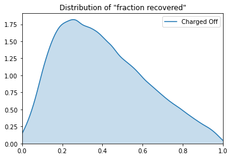
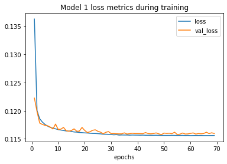

# LendingClub Loan Risk Neural Network

<h3 style="font-style: italic; color: #6c757d;">
  or, Ty Goes Into Far Too Much Detail About Cleaning Data
</h3>

1. **[Introduction](#introduction)**
2. **[Data cleaning](#data-cleaning)**
3. **[Building the neural networks](#building-the-neural-networks)**
4. **[Saving the final model](#saving-the-final-model)**
5. **[Building the API](#building-the-api)**

<h2 id="introduction">Introduction</h2>

[LendingClub](https://www.lendingclub.com/) is the world's largest peer-to-peer lending platform. Until recently (through the end of 2018), LendingClub published a public dataset of all loans issued since the company's launch in 2007. I'm accessing the dataset [via Kaggle](https://www.kaggle.com/wordsforthewise/lending-club).

```python
import pandas as pd

loans = pd.read_csv(
    "../input/lending-club/accepted_2007_to_2018q4.csv/accepted_2007_to_2018Q4.csv",
    low_memory=False,
)

loans.shape
```

```plaintext
(2260701, 151)
```

With 2,260,701 loans to look at and 151 potential variables, my goal is to create a neural network model to predict the fraction of an expected loan return that a prospective borrower will pay back. Afterward, I'll create a public API to serve that model.

Also, as you may have guessed from the preceding code block, this post is adapted from a Jupyter Notebook. If you'd like to follow along in your own notebook, go ahead and fork mine on [Kaggle](https://www.kaggle.com/tywmick/building-a-neural-network-to-predict-loan-risk "Building a Neural Network to Predict Loan Risk | Kaggle") or [GitHub]()

<h2 id="data-cleaning">Data cleaning</h2>

I'll first look at the data dictionary (accessed from a [different Kaggle dataset](https://www.kaggle.com/wendykan/lending-club-loan-data)) to get an idea of how to create the desired output variable and which remaining features are available at the point of loan application (to avoid data leakage).

```python
dictionary_df = pd.read_excel("../input/lending-club-loan-data/LCDataDictionary.xlsx")

# Drop blank rows, strip white space, convert to Python dictionary, fix one key name
dictionary_df.dropna(axis="index", inplace=True)
dictionary_df = dictionary_df.applymap(lambda x: x.strip())
dictionary_df.set_index("LoanStatNew", inplace=True)
dictionary = dictionary_df["Description"].to_dict()
dictionary["verification_status_joint"] = dictionary.pop("verified_status_joint")

# Print in order of dataset columns (which makes more sense than dictionary's order)
for col in loans.columns:
    print(f"•{col}: {dictionary[col]}")
```

```plaintext
•id: A unique LC assigned ID for the loan listing.
•member_id: A unique LC assigned Id for the borrower member.
•loan_amnt: The listed amount of the loan applied for by the borrower. If at some point in time, the credit department reduces the loan amount, then it will be reflected in this value.
•funded_amnt: The total amount committed to that loan at that point in time.
•funded_amnt_inv: The total amount committed by investors for that loan at that point in time.
•term: The number of payments on the loan. Values are in months and can be either 36 or 60.
•int_rate: Interest Rate on the loan
•installment: The monthly payment owed by the borrower if the loan originates.
•grade: LC assigned loan grade
•sub_grade: LC assigned loan subgrade
•emp_title: The job title supplied by the Borrower when applying for the loan.*
•emp_length: Employment length in years. Possible values are between 0 and 10 where 0 means less than one year and 10 means ten or more years.
•home_ownership: The home ownership status provided by the borrower during registration or obtained from the credit report. Our values are: RENT, OWN, MORTGAGE, OTHER
•annual_inc: The self-reported annual income provided by the borrower during registration.
•verification_status: Indicates if income was verified by LC, not verified, or if the income source was verified
•issue_d: The month which the loan was funded
•loan_status: Current status of the loan
•pymnt_plan: Indicates if a payment plan has been put in place for the loan
•url: URL for the LC page with listing data.
•desc: Loan description provided by the borrower
•purpose: A category provided by the borrower for the loan request.
•title: The loan title provided by the borrower
•zip_code: The first 3 numbers of the zip code provided by the borrower in the loan application.
•addr_state: The state provided by the borrower in the loan application
•dti: A ratio calculated using the borrower’s total monthly debt payments on the total debt obligations, excluding mortgage and the requested LC loan, divided by the borrower’s self-reported monthly income.
•delinq_2yrs: The number of 30+ days past-due incidences of delinquency in the borrower's credit file for the past 2 years
•earliest_cr_line: The month the borrower's earliest reported credit line was opened
•fico_range_low: The lower boundary range the borrower’s FICO at loan origination belongs to.
•fico_range_high: The upper boundary range the borrower’s FICO at loan origination belongs to.
•inq_last_6mths: The number of inquiries in past 6 months (excluding auto and mortgage inquiries)
•mths_since_last_delinq: The number of months since the borrower's last delinquency.
•mths_since_last_record: The number of months since the last public record.
•open_acc: The number of open credit lines in the borrower's credit file.
•pub_rec: Number of derogatory public records
•revol_bal: Total credit revolving balance
•revol_util: Revolving line utilization rate, or the amount of credit the borrower is using relative to all available revolving credit.
•total_acc: The total number of credit lines currently in the borrower's credit file
•initial_list_status: The initial listing status of the loan. Possible values are – W, F
•out_prncp: Remaining outstanding principal for total amount funded
•out_prncp_inv: Remaining outstanding principal for portion of total amount funded by investors
•total_pymnt: Payments received to date for total amount funded
•total_pymnt_inv: Payments received to date for portion of total amount funded by investors
•total_rec_prncp: Principal received to date
•total_rec_int: Interest received to date
•total_rec_late_fee: Late fees received to date
•recoveries: post charge off gross recovery
•collection_recovery_fee: post charge off collection fee
•last_pymnt_d: Last month payment was received
•last_pymnt_amnt: Last total payment amount received
•next_pymnt_d: Next scheduled payment date
•last_credit_pull_d: The most recent month LC pulled credit for this loan
•last_fico_range_high: The upper boundary range the borrower’s last FICO pulled belongs to.
•last_fico_range_low: The lower boundary range the borrower’s last FICO pulled belongs to.
•collections_12_mths_ex_med: Number of collections in 12 months excluding medical collections
•mths_since_last_major_derog: Months since most recent 90-day or worse rating
•policy_code: publicly available policy_code=1
new products not publicly available policy_code=2
•application_type: Indicates whether the loan is an individual application or a joint application with two co-borrowers
•annual_inc_joint: The combined self-reported annual income provided by the co-borrowers during registration
•dti_joint: A ratio calculated using the co-borrowers' total monthly payments on the total debt obligations, excluding mortgages and the requested LC loan, divided by the co-borrowers' combined self-reported monthly income
•verification_status_joint: Indicates if the co-borrowers' joint income was verified by LC, not verified, or if the income source was verified
•acc_now_delinq: The number of accounts on which the borrower is now delinquent.
•tot_coll_amt: Total collection amounts ever owed
•tot_cur_bal: Total current balance of all accounts
•open_acc_6m: Number of open trades in last 6 months
•open_act_il: Number of currently active installment trades
•open_il_12m: Number of installment accounts opened in past 12 months
•open_il_24m: Number of installment accounts opened in past 24 months
•mths_since_rcnt_il: Months since most recent installment accounts opened
•total_bal_il: Total current balance of all installment accounts
•il_util: Ratio of total current balance to high credit/credit limit on all install acct
•open_rv_12m: Number of revolving trades opened in past 12 months
•open_rv_24m: Number of revolving trades opened in past 24 months
•max_bal_bc: Maximum current balance owed on all revolving accounts
•all_util: Balance to credit limit on all trades
•total_rev_hi_lim: Total revolving high credit/credit limit
•inq_fi: Number of personal finance inquiries
•total_cu_tl: Number of finance trades
•inq_last_12m: Number of credit inquiries in past 12 months
•acc_open_past_24mths: Number of trades opened in past 24 months.
•avg_cur_bal: Average current balance of all accounts
•bc_open_to_buy: Total open to buy on revolving bankcards.
•bc_util: Ratio of total current balance to high credit/credit limit for all bankcard accounts.
•chargeoff_within_12_mths: Number of charge-offs within 12 months
•delinq_amnt: The past-due amount owed for the accounts on which the borrower is now delinquent.
•mo_sin_old_il_acct: Months since oldest bank installment account opened
•mo_sin_old_rev_tl_op: Months since oldest revolving account opened
•mo_sin_rcnt_rev_tl_op: Months since most recent revolving account opened
•mo_sin_rcnt_tl: Months since most recent account opened
•mort_acc: Number of mortgage accounts.
•mths_since_recent_bc: Months since most recent bankcard account opened.
•mths_since_recent_bc_dlq: Months since most recent bankcard delinquency
•mths_since_recent_inq: Months since most recent inquiry.
•mths_since_recent_revol_delinq: Months since most recent revolving delinquency.
•num_accts_ever_120_pd: Number of accounts ever 120 or more days past due
•num_actv_bc_tl: Number of currently active bankcard accounts
•num_actv_rev_tl: Number of currently active revolving trades
•num_bc_sats: Number of satisfactory bankcard accounts
•num_bc_tl: Number of bankcard accounts
•num_il_tl: Number of installment accounts
•num_op_rev_tl: Number of open revolving accounts
•num_rev_accts: Number of revolving accounts
•num_rev_tl_bal_gt_0: Number of revolving trades with balance >0
•num_sats: Number of satisfactory accounts
•num_tl_120dpd_2m: Number of accounts currently 120 days past due (updated in past 2 months)
•num_tl_30dpd: Number of accounts currently 30 days past due (updated in past 2 months)
•num_tl_90g_dpd_24m: Number of accounts 90 or more days past due in last 24 months
•num_tl_op_past_12m: Number of accounts opened in past 12 months
•pct_tl_nvr_dlq: Percent of trades never delinquent
•percent_bc_gt_75: Percentage of all bankcard accounts > 75% of limit.
•pub_rec_bankruptcies: Number of public record bankruptcies
•tax_liens: Number of tax liens
•tot_hi_cred_lim: Total high credit/credit limit
•total_bal_ex_mort: Total credit balance excluding mortgage
•total_bc_limit: Total bankcard high credit/credit limit
•total_il_high_credit_limit: Total installment high credit/credit limit
•revol_bal_joint: Sum of revolving credit balance of the co-borrowers, net of duplicate balances
•sec_app_fico_range_low: FICO range (high) for the secondary applicant
•sec_app_fico_range_high: FICO range (low) for the secondary applicant
•sec_app_earliest_cr_line: Earliest credit line at time of application for the secondary applicant
•sec_app_inq_last_6mths: Credit inquiries in the last 6 months at time of application for the secondary applicant
•sec_app_mort_acc: Number of mortgage accounts at time of application for the secondary applicant
•sec_app_open_acc: Number of open trades at time of application for the secondary applicant
•sec_app_revol_util: Ratio of total current balance to high credit/credit limit for all revolving accounts
•sec_app_open_act_il: Number of currently active installment trades at time of application for the secondary applicant
•sec_app_num_rev_accts: Number of revolving accounts at time of application for the secondary applicant
•sec_app_chargeoff_within_12_mths: Number of charge-offs within last 12 months at time of application for the secondary applicant
•sec_app_collections_12_mths_ex_med: Number of collections within last 12 months excluding medical collections at time of application for the secondary applicant
•sec_app_mths_since_last_major_derog: Months since most recent 90-day or worse rating at time of application for the secondary applicant
•hardship_flag: Flags whether or not the borrower is on a hardship plan
•hardship_type: Describes the hardship plan offering
•hardship_reason: Describes the reason the hardship plan was offered
•hardship_status: Describes if the hardship plan is active, pending, canceled, completed, or broken
•deferral_term: Amount of months that the borrower is expected to pay less than the contractual monthly payment amount due to a hardship plan
•hardship_amount: The interest payment that the borrower has committed to make each month while they are on a hardship plan
•hardship_start_date: The start date of the hardship plan period
•hardship_end_date: The end date of the hardship plan period
•payment_plan_start_date: The day the first hardship plan payment is due. For example, if a borrower has a hardship plan period of 3 months, the start date is the start of the three-month period in which the borrower is allowed to make interest-only payments.
•hardship_length: The number of months the borrower will make smaller payments than normally obligated due to a hardship plan
•hardship_dpd: Account days past due as of the hardship plan start date
•hardship_loan_status: Loan Status as of the hardship plan start date
•orig_projected_additional_accrued_interest: The original projected additional interest amount that will accrue for the given hardship payment plan as of the Hardship Start Date. This field will be null if the borrower has broken their hardship payment plan.
•hardship_payoff_balance_amount: The payoff balance amount as of the hardship plan start date
•hardship_last_payment_amount: The last payment amount as of the hardship plan start date
•disbursement_method: The method by which the borrower receives their loan. Possible values are: CASH, DIRECT_PAY
•debt_settlement_flag: Flags whether or not the borrower, who has charged-off, is working with a debt-settlement company.
•debt_settlement_flag_date: The most recent date that the Debt_Settlement_Flag has been set
•settlement_status: The status of the borrower’s settlement plan. Possible values are: COMPLETE, ACTIVE, BROKEN, CANCELLED, DENIED, DRAFT
•settlement_date: The date that the borrower agrees to the settlement plan
•settlement_amount: The loan amount that the borrower has agreed to settle for
•settlement_percentage: The settlement amount as a percentage of the payoff balance amount on the loan
•settlement_term: The number of months that the borrower will be on the settlement plan
```

For the output variable (the fraction of expected return that was recovered), I'll calculated the _expected return_ by multiplying the monthly payment amount (`installment`) by the number of payments on the loan (`term`), and I'll calculate the _amount actually received_ by summing the total principle, interest, late fees, and post-chargeoff gross recovery received (`total_rec_prncp`, `total_rec_int`, `total_rec_late_fee`, `recoveries`) and subtracting any collection fee (`collection_recovery_fee`).

```python
cols_for_output = ["term", "installment", "total_rec_prncp", "total_rec_int", "total_rec_late_fee", "recoveries", "collection_recovery_fee"]
```

Several other columns contain either irrelevant demographic data or data not created until after a loan is accepted, so those will need to be removed. I'll hold onto `issue_d` (the month and year the loan was funded) for now, though, in case I want to compare variables to the date of the loan.

`emp_title` (the applicant's job title) _does_ seem relevant in the context of a loan, but it may have too many unique values to be useful.

```python
loans["emp_title"].nunique()
```

```plaintext
512694
```

Too many unique values indeed. In a future version of this model I could perhaps try to generate a feature from this column by aggregating job titles into categories, but that effort may have a low return on investment, since there are already columns for annual income and length of employment.

Two other interesting columns that I'll also remove are `title` and `desc` ("description"), which are both freeform text entries written by the borrower. These could be fascinating subjects for natural language processing, but that's outside the scope of the current project. Perhaps in the future I could generate additional features from these fields using measures like syntactic complexity, word count, or keyword inclusion.

```python
cols_to_drop = ["id", "member_id", "funded_amnt", "funded_amnt_inv", "int_rate", "grade", "sub_grade", "emp_title", "pymnt_plan", "url", "desc", "title", "zip_code", "addr_state", "initial_list_status", "out_prncp", "out_prncp_inv", "total_pymnt", "total_pymnt_inv", "last_pymnt_d", "last_pymnt_amnt", "next_pymnt_d", "last_credit_pull_d", "last_fico_range_high", "last_fico_range_low", "policy_code", "hardship_flag", "hardship_type", "hardship_reason", "hardship_status", "deferral_term", "hardship_amount", "hardship_start_date", "hardship_end_date", "payment_plan_start_date", "hardship_length", "hardship_dpd", "hardship_loan_status", "orig_projected_additional_accrued_interest", "hardship_payoff_balance_amount", "hardship_last_payment_amount", "disbursement_method", "debt_settlement_flag", "debt_settlement_flag_date", "settlement_status", "settlement_date", "settlement_amount", "settlement_percentage", "settlement_term"]
loans = loans.drop(columns=cols_to_drop)
```

Before creating the output variable, however, I must take a closer look at `loan_status`, to see if any loans in the dataset are still open.

```python
loans.groupby("loan_status")["loan_status"].count()
```

```plaintext
loan_status
Charged Off                                             268559
Current                                                 878317
Default                                                     40
Does not meet the credit policy. Status:Charged Off        761
Does not meet the credit policy. Status:Fully Paid        1988
Fully Paid                                             1076751
In Grace Period                                           8436
Late (16-30 days)                                         4349
Late (31-120 days)                                       21467
Name: loan_status, dtype: int64
```

For practical purposes, I'll consider loans with statuses that don't contain "Fully Paid" or "Charged Off" to still be open, so I'll remove those from the dataset. I'll also merge the "credit policy" columns with their matching status.

```python
credit_policy = "Does not meet the credit policy. Status:"
len_credit_policy = len(credit_policy)
remove_credit_policy = (
    lambda status: status[len_credit_policy:]
    if credit_policy in str(status)
    else status
)
loans["loan_status"] = loans["loan_status"].map(remove_credit_policy)

rows_to_drop = loans[
    (loans["loan_status"] != "Charged Off") & (loans["loan_status"] != "Fully Paid")
].index
loans.drop(index=rows_to_drop, inplace=True)

loans.groupby("loan_status")["loan_status"].count()
```

```plaintext
loan_status
Charged Off     269320
Fully Paid     1078739
Name: loan_status, dtype: int64
```

Now to create the output variable. I'll start by checking the null counts of the variables involved.

```python
loans[cols_for_output].info()
```

```plaintext
<class 'pandas.core.frame.DataFrame'>
Int64Index: 1348059 entries, 0 to 2260697
Data columns (total 7 columns):
 #   Column                   Non-Null Count    Dtype
---  ------                   --------------    -----
 0   term                     1348059 non-null  object
 1   installment              1348059 non-null  float64
 2   total_rec_prncp          1348059 non-null  float64
 3   total_rec_int            1348059 non-null  float64
 4   total_rec_late_fee       1348059 non-null  float64
 5   recoveries               1348059 non-null  float64
 6   collection_recovery_fee  1348059 non-null  float64
dtypes: float64(6), object(1)
memory usage: 82.3+ MB
```

Every remaining row has each of these seven variables, but `term`'s data type is `object`, so that needs to be fixed first.

```python
loans.groupby("term")["term"].count()
```

```plaintext
term
 36 months    1023181
 60 months     324878
Name: term, dtype: int64
```

Ah, so `term` is a categorical feature with two options. I'll treate it as such when I use it as an input to the model, but to calculate the ouput variable I'll create a numerical column from it.

Also, I need to trim the whitespace from the beginning of those values—that's no good.

```python
onehot_cols = ["term"]

loans["term"] = loans["term"].map(lambda term_str: term_str.strip())

extract_num = lambda term_str: float(term_str[:2])
loans["term_num"] = loans["term"].map(extract_num)
cols_for_output.remove("term")
cols_for_output.append("term_num")
```

_Now_ I can create the output variable.

```python
received = (
    loans["total_rec_prncp"]
    + loans["total_rec_int"]
    + loans["total_rec_late_fee"]
    + loans["recoveries"]
    - loans["collection_recovery_fee"]
)
expected = loans["installment"] * loans["term_num"]
loans["fraction_recovered"] = received / expected

loans.groupby("loan_status")["fraction_recovered"].describe()
```

<div class="data-table">
  <style scoped>
    .dataframe tbody tr th:only-of-type {
      vertical-align: middle;
    }
    .dataframe tbody tr th {
      vertical-align: top;
    }
    .dataframe thead th {
      text-align: right;
    }
    .dataframe tbody tr td {
      text-align: right;
    }
  </style>
  <table border="1" class="dataframe">
    <thead>
      <tr style="text-align: right;">
        <th></th>
        <th>count</th>
        <th>mean</th>
        <th>std</th>
        <th>min</th>
        <th>25%</th>
        <th>50%</th>
        <th>75%</th>
        <th>max</th>
      </tr>
      <tr>
        <th>loan_status</th>
        <th></th>
        <th></th>
        <th></th>
        <th></th>
        <th></th>
        <th></th>
        <th></th>
        <th></th>
      </tr>
    </thead>
    <tbody>
      <tr>
        <th>Charged Off</th>
        <td>269320.0</td>
        <td>0.400162</td>
        <td>0.219020</td>
        <td>0.000000</td>
        <td>0.224463</td>
        <td>0.367554</td>
        <td>0.550924</td>
        <td>2.410680</td>
      </tr>
      <tr>
        <th>Fully Paid</th>
        <td>1078739.0</td>
        <td>0.932705</td>
        <td>0.100455</td>
        <td>0.506053</td>
        <td>0.897912</td>
        <td>0.960100</td>
        <td>0.997612</td>
        <td>60.932353</td>
      </tr>
    </tbody>
  </table>
</div>

There is at least one odd outlier on the right in both categories. But also, many of the "fully paid" loans do not quite reach 1. One potential explanation is that when the last payment comes in, the system just flips `loan_status` to "Fully Paid" without adding the payment amount to the system itself, or perhaps simply multiplying `installation` by the `term` number leaves off a few cents in the actual total. If I were performing this analysis for Lending Club themselves, I'd ask them, but this is just a personal project. I'll consider every loan marked "Fully Paid" to have fully recovered the expected return.

For that matter, I'll cap my `fraction_recovered` values for charged off loans at 1.0 as well, since at least one value is above that for some reason.

```python
import numpy as np

loans["fraction_recovered"] = np.where(
    (loans["loan_status"] == "Fully Paid") | (loans["fraction_recovered"] > 1.0),
    1.0,
    loans["fraction_recovered"],
)
loans.groupby("loan_status")["fraction_recovered"].describe()
```

<div class="data-table">
  <style scoped>
    .dataframe tbody tr th:only-of-type {
      vertical-align: middle;
  }
    .dataframe tbody tr th {
      vertical-align: top;
  }
    .dataframe thead th {
      text-align: right;
  }
  </style>
  <table border="1" class="dataframe">
    <thead>
      <tr style="text-align: right;">
        <th></th>
        <th>count</th>
        <th>mean</th>
        <th>std</th>
        <th>min</th>
        <th>25%</th>
        <th>50%</th>
        <th>75%</th>
        <th>max</th>
      </tr>
      <tr>
        <th>loan_status</th>
        <th></th>
        <th></th>
        <th></th>
        <th></th>
        <th></th>
        <th></th>
        <th></th>
        <th></th>
      </tr>
    </thead>
    <tbody>
      <tr>
        <th>Charged Off</th>
        <td>269320.0</td>
        <td>0.400152</td>
        <td>0.218971</td>
        <td>0.0</td>
        <td>0.224463</td>
        <td>0.367554</td>
        <td>0.550924</td>
        <td>1.0</td>
      </tr>
      <tr>
        <th>Fully Paid</th>
        <td>1078739.0</td>
        <td>1.000000</td>
        <td>0.000000</td>
        <td>1.0</td>
        <td>1.000000</td>
        <td>1.000000</td>
        <td>1.000000</td>
        <td>1.0</td>
      </tr>
    </tbody>
  </table>
</div>

For the sake of curiosity, I'll plot the distribution of fraction recovered for charged-off loans.

```python
import matplotlib.pyplot as plt
%matplotlib inline
import seaborn as sns

sns.kdeplot(
    data=loans["fraction_recovered"][loans["loan_status"] == "Charged Off"],
    label="Charged Off",
    shade=True,
)
plt.axis(xmin=0, xmax=1)
plt.title('Distribution of "fraction recovered"')
plt.show()
```



Now that the output is formatted, it's time to clean up the inputs. I'll check the null counts of each variable.

```python
loans.drop(columns=cols_for_output, inplace=True)
loans.info(verbose=True, null_counts=True)
```

```plaintext
<class 'pandas.core.frame.DataFrame'>
Int64Index: 1348059 entries, 0 to 2260697
Data columns (total 97 columns):
 #   Column                               Non-Null Count    Dtype
---  ------                               --------------    -----
 0   loan_amnt                            1348059 non-null  float64
 1   term                                 1348059 non-null  object
 2   emp_length                           1269514 non-null  object
 3   home_ownership                       1348059 non-null  object
 4   annual_inc                           1348055 non-null  float64
 5   verification_status                  1348059 non-null  object
 6   issue_d                              1348059 non-null  object
 7   loan_status                          1348059 non-null  object
 8   purpose                              1348059 non-null  object
 9   dti                                  1347685 non-null  float64
 10  delinq_2yrs                          1348030 non-null  float64
 11  earliest_cr_line                     1348030 non-null  object
 12  fico_range_low                       1348059 non-null  float64
 13  fico_range_high                      1348059 non-null  float64
 14  inq_last_6mths                       1348029 non-null  float64
 15  mths_since_last_delinq               668117 non-null   float64
 16  mths_since_last_record               229415 non-null   float64
 17  open_acc                             1348030 non-null  float64
 18  pub_rec                              1348030 non-null  float64
 19  revol_bal                            1348059 non-null  float64
 20  revol_util                           1347162 non-null  float64
 21  total_acc                            1348030 non-null  float64
 22  collections_12_mths_ex_med           1347914 non-null  float64
 23  mths_since_last_major_derog          353750 non-null   float64
 24  application_type                     1348059 non-null  object
 25  annual_inc_joint                     25800 non-null    float64
 26  dti_joint                            25797 non-null    float64
 27  verification_status_joint            25595 non-null    object
 28  acc_now_delinq                       1348030 non-null  float64
 29  tot_coll_amt                         1277783 non-null  float64
 30  tot_cur_bal                          1277783 non-null  float64
 31  open_acc_6m                          537597 non-null   float64
 32  open_act_il                          537598 non-null   float64
 33  open_il_12m                          537598 non-null   float64
 34  open_il_24m                          537598 non-null   float64
 35  mths_since_rcnt_il                   523382 non-null   float64
 36  total_bal_il                         537598 non-null   float64
 37  il_util                              465016 non-null   float64
 38  open_rv_12m                          537598 non-null   float64
 39  open_rv_24m                          537598 non-null   float64
 40  max_bal_bc                           537598 non-null   float64
 41  all_util                             537545 non-null   float64
 42  total_rev_hi_lim                     1277783 non-null  float64
 43  inq_fi                               537598 non-null   float64
 44  total_cu_tl                          537597 non-null   float64
 45  inq_last_12m                         537597 non-null   float64
 46  acc_open_past_24mths                 1298029 non-null  float64
 47  avg_cur_bal                          1277761 non-null  float64
 48  bc_open_to_buy                       1284167 non-null  float64
 49  bc_util                              1283398 non-null  float64
 50  chargeoff_within_12_mths             1347914 non-null  float64
 51  delinq_amnt                          1348030 non-null  float64
 52  mo_sin_old_il_acct                   1239735 non-null  float64
 53  mo_sin_old_rev_tl_op                 1277782 non-null  float64
 54  mo_sin_rcnt_rev_tl_op                1277782 non-null  float64
 55  mo_sin_rcnt_tl                       1277783 non-null  float64
 56  mort_acc                             1298029 non-null  float64
 57  mths_since_recent_bc                 1285089 non-null  float64
 58  mths_since_recent_bc_dlq             319020 non-null   float64
 59  mths_since_recent_inq                1171239 non-null  float64
 60  mths_since_recent_revol_delinq       449962 non-null   float64
 61  num_accts_ever_120_pd                1277783 non-null  float64
 62  num_actv_bc_tl                       1277783 non-null  float64
 63  num_actv_rev_tl                      1277783 non-null  float64
 64  num_bc_sats                          1289469 non-null  float64
 65  num_bc_tl                            1277783 non-null  float64
 66  num_il_tl                            1277783 non-null  float64
 67  num_op_rev_tl                        1277783 non-null  float64
 68  num_rev_accts                        1277782 non-null  float64
 69  num_rev_tl_bal_gt_0                  1277783 non-null  float64
 70  num_sats                             1289469 non-null  float64
 71  num_tl_120dpd_2m                     1227909 non-null  float64
 72  num_tl_30dpd                         1277783 non-null  float64
 73  num_tl_90g_dpd_24m                   1277783 non-null  float64
 74  num_tl_op_past_12m                   1277783 non-null  float64
 75  pct_tl_nvr_dlq                       1277629 non-null  float64
 76  percent_bc_gt_75                     1283755 non-null  float64
 77  pub_rec_bankruptcies                 1346694 non-null  float64
 78  tax_liens                            1347954 non-null  float64
 79  tot_hi_cred_lim                      1277783 non-null  float64
 80  total_bal_ex_mort                    1298029 non-null  float64
 81  total_bc_limit                       1298029 non-null  float64
 82  total_il_high_credit_limit           1277783 non-null  float64
 83  revol_bal_joint                      18629 non-null    float64
 84  sec_app_fico_range_low               18630 non-null    float64
 85  sec_app_fico_range_high              18630 non-null    float64
 86  sec_app_earliest_cr_line             18630 non-null    object
 87  sec_app_inq_last_6mths               18630 non-null    float64
 88  sec_app_mort_acc                     18630 non-null    float64
 89  sec_app_open_acc                     18630 non-null    float64
 90  sec_app_revol_util                   18302 non-null    float64
 91  sec_app_open_act_il                  18630 non-null    float64
 92  sec_app_num_rev_accts                18630 non-null    float64
 93  sec_app_chargeoff_within_12_mths     18630 non-null    float64
 94  sec_app_collections_12_mths_ex_med   18630 non-null    float64
 95  sec_app_mths_since_last_major_derog  6645 non-null     float64
 96  fraction_recovered                   1348059 non-null  float64
dtypes: float64(86), object(11)
memory usage: 1007.9+ MB
```

Remaining columns with lots of null values seem to fall into three categories:

1. Derogatory/delinquency metrics (where null means the borrower doesn't have any such marks)
   - I'll also add `mths_since_recent_inq` to this list, since its non-null count is below what seems to be the threshold for complete data, which is around 1,277,783. I'll assume a null value here means no recent inquiries.
2. Metrics that only apply to joint applications (where null means it was a single application)
3. An inexplicable series of 14 credit history–related columns that only have around 537,000 entries. Are these newer metrics?

```python
negative_mark_cols = ["mths_since_last_delinq", "mths_since_last_record", "mths_since_last_major_derog", "mths_since_recent_bc_dlq", "mths_since_recent_inq", "mths_since_recent_revol_delinq", "mths_since_recent_revol_delinq", "sec_app_mths_since_last_major_derog"]
joint_cols = ["annual_inc_joint", "dti_joint", "verification_status_joint", "revol_bal_joint", "sec_app_fico_range_low", "sec_app_fico_range_high", "sec_app_earliest_cr_line", "sec_app_inq_last_6mths", "sec_app_mort_acc", "sec_app_open_acc", "sec_app_revol_util", "sec_app_open_act_il", "sec_app_num_rev_accts", "sec_app_chargeoff_within_12_mths", "sec_app_collections_12_mths_ex_med", "sec_app_mths_since_last_major_derog"]
confusing_cols = ["open_acc_6m", "open_act_il", "open_il_12m", "open_il_24m", "mths_since_rcnt_il", "total_bal_il", "il_util", "open_rv_12m", "open_rv_24m", "max_bal_bc", "all_util", "inq_fi", "total_cu_tl", "inq_last_12m"]
```

I'll first look at those more confusing columns to find out whether or not they're a newer set of metrics. That'll require converting `issue_d` to date format first.

```python
loans["issue_d"] = loans["issue_d"].astype("datetime64[ns]")

# Check date range of confusing columns
loans[confusing_cols + ["issue_d"]].dropna(axis="index")["issue_d"].agg(
    ["count", "min", "max"]
)
```

```plaintext
count                 464325
min      2015-12-01 00:00:00
max      2018-12-01 00:00:00
Name: issue_d, dtype: object
```

```python
# Compare to all entries from Dec 2015 onward
loans["issue_d"][loans["issue_d"] >= np.datetime64("2015-12-01")].agg(
    ["count", "min", "max"]
)
```

```plaintext
count                 557708
min      2015-12-01 00:00:00
max      2018-12-01 00:00:00
Name: issue_d, dtype: object
```

It appears that these are indeed newer metrics, their use only beginning in December 2015, but even after that point usage is spotty. I'm curious to see if these additional metrics would make a model more accurate, though, so once I'm done cleaning the data I'll copy the rows with these new metrics into a new dataset and create another model using the new metrics.

```python
new_metric_cols = confusing_cols
```

As for the derogatory/delinquency metrics, taking a cue [from Michael Wurm](https://towardsdatascience.com/intelligent-loan-selection-for-peer-to-peer-lending-575dfa2573cb), I'm going to take the inverse of all the "months since recent/last" fields, which will turn each into a proxy for the frequency of the event and also let me set all the null values (when an event has never happened) to 0. For the "months since oldest" fields, I'll just set the null values to 0 and leave the rest untouched.

```python
mths_since_last_cols = [
    col_name
    for col_name in loans.columns
    if "mths_since" in col_name or "mo_sin_rcnt" in col_name
]
mths_since_old_cols = [
    col_name for col_name in loans.columns if "mo_sin_old" in col_name
]

for col_name in mths_since_last_cols:
    loans[col_name] = [
        0.0 if pd.isna(months) else 1 / 1 if months == 0 else 1 / months
        for months in loans[col_name]
    ]
loans.loc[:, mths_since_old_cols].fillna(0, inplace=True)

# Rename inverse columns
rename_mapper = {}
for col_name in mths_since_last_cols:
    rename_mapper[col_name] = col_name.replace("mths_since", "inv_mths_since").replace(
        "mo_sin_rcnt", "inv_mo_sin_rcnt"
    )
loans.rename(columns=rename_mapper, inplace=True)


def replace_list_value(l, old_value, new_value):
    i = l.index(old_value)
    l.pop(i)
    l.insert(i, new_value)


replace_list_value(new_metric_cols, "mths_since_rcnt_il", "inv_mths_since_rcnt_il")
replace_list_value(
    joint_cols,
    "sec_app_mths_since_last_major_derog",
    "sec_app_inv_mths_since_last_major_derog",
)
```

Now to look closer at joint loans.

```python
loans.groupby("application_type")["application_type"].count()
```

```plaintext
application_type
Individual    1322259
Joint App       25800
Name: application_type, dtype: int64
```

```python
joint_loans = loans[:][loans["application_type"] == "Joint App"]
joint_loans[joint_cols].info()
```

```plaintext
<class 'pandas.core.frame.DataFrame'>
Int64Index: 25800 entries, 2 to 2260663
Data columns (total 16 columns):
 #   Column                                   Non-Null Count  Dtype
---  ------                                   --------------  -----
 0   annual_inc_joint                         25800 non-null  float64
 1   dti_joint                                25797 non-null  float64
 2   verification_status_joint                25595 non-null  object
 3   revol_bal_joint                          18629 non-null  float64
 4   sec_app_fico_range_low                   18630 non-null  float64
 5   sec_app_fico_range_high                  18630 non-null  float64
 6   sec_app_earliest_cr_line                 18630 non-null  object
 7   sec_app_inq_last_6mths                   18630 non-null  float64
 8   sec_app_mort_acc                         18630 non-null  float64
 9   sec_app_open_acc                         18630 non-null  float64
 10  sec_app_revol_util                       18302 non-null  float64
 11  sec_app_open_act_il                      18630 non-null  float64
 12  sec_app_num_rev_accts                    18630 non-null  float64
 13  sec_app_chargeoff_within_12_mths         18630 non-null  float64
 14  sec_app_collections_12_mths_ex_med       18630 non-null  float64
 15  sec_app_inv_mths_since_last_major_derog  25800 non-null  float64
dtypes: float64(14), object(2)
memory usage: 3.3+ MB
```

It seems there may be a case of newer metrics for joint applications as well. I'll investigate.

```python
joint_new_metric_cols = ["revol_bal_joint", "sec_app_fico_range_low", "sec_app_fico_range_high", "sec_app_earliest_cr_line", "sec_app_inq_last_6mths", "sec_app_mort_acc", "sec_app_open_acc", "sec_app_revol_util", "sec_app_open_act_il", "sec_app_num_rev_accts", "sec_app_chargeoff_within_12_mths", "sec_app_collections_12_mths_ex_med", "sec_app_inv_mths_since_last_major_derog"]
joint_loans[joint_new_metric_cols + ["issue_d"]].dropna(axis="index")["issue_d"].agg(
    ["count", "min", "max"]
)
```

```plaintext
count                  18301
min      2017-03-01 00:00:00
max      2018-12-01 00:00:00
Name: issue_d, dtype: object
```

```python
# Check without `sec_app_revol_util` column
joint_new_metric_cols_2 = ["revol_bal_joint", "sec_app_fico_range_low", "sec_app_fico_range_high", "sec_app_earliest_cr_line", "sec_app_inq_last_6mths", "sec_app_mort_acc", "sec_app_open_acc", "sec_app_open_act_il", "sec_app_num_rev_accts", "sec_app_chargeoff_within_12_mths", "sec_app_collections_12_mths_ex_med", "sec_app_inv_mths_since_last_major_derog"]
joint_loans[joint_new_metric_cols_2 + ["issue_d"]].dropna(axis="index")["issue_d"].agg(
    ["count", "min", "max"]
)
```

```plaintext
count                  18629
min      2017-03-01 00:00:00
max      2018-12-01 00:00:00
Name: issue_d, dtype: object
```

Newer than the previous set of new metrics, even—these didn't start getting used till March 2017. Now I wonder when joint loans were first introduced.

```python
joint_loans["issue_d"].agg(["count", "min", "max"])
```

```plaintext
count                  25800
min      2015-10-01 00:00:00
max      2018-12-01 00:00:00
Name: issue_d, dtype: object
```

2015\. I think I'll save the newer joint metrics for perhaps a third model, but I believe I can include `annual_inc_joint`, `dti_joint`, and `verification_status_joint` in the main model—I'll just binary-encode `application_type`, and for individual applications I'll set `annual_inc_joint`, `dti_joint`, and `verification_status_joint` equal to their non-joint counterparts.

```python
onehot_cols.append("application_type")

# Fill joint columns in individual applications
for joint_col, indiv_col in zip(
    ["annual_inc_joint", "dti_joint", "verification_status_joint"],
    ["annual_inc", "dti", "verification_status"],
):
    loans[joint_col] = [
        joint_val if app_type == "Joint App" else indiv_val
        for app_type, joint_val, indiv_val in zip(
            loans["application_type"], loans[joint_col], loans[indiv_col]
        )
    ]

loans.info(verbose=True, null_counts=True)
```

```plaintext
<class 'pandas.core.frame.DataFrame'>
Int64Index: 1348059 entries, 0 to 2260697
Data columns (total 97 columns):
 #   Column                                   Non-Null Count    Dtype
---  ------                                   --------------    -----
 0   loan_amnt                                1348059 non-null  float64
 1   term                                     1348059 non-null  object
 2   emp_length                               1269514 non-null  object
 3   home_ownership                           1348059 non-null  object
 4   annual_inc                               1348055 non-null  float64
 5   verification_status                      1348059 non-null  object
 6   issue_d                                  1348059 non-null  datetime64[ns]
 7   loan_status                              1348059 non-null  object
 8   purpose                                  1348059 non-null  object
 9   dti                                      1347685 non-null  float64
 10  delinq_2yrs                              1348030 non-null  float64
 11  earliest_cr_line                         1348030 non-null  object
 12  fico_range_low                           1348059 non-null  float64
 13  fico_range_high                          1348059 non-null  float64
 14  inq_last_6mths                           1348029 non-null  float64
 15  inv_mths_since_last_delinq               1348059 non-null  float64
 16  inv_mths_since_last_record               1348059 non-null  float64
 17  open_acc                                 1348030 non-null  float64
 18  pub_rec                                  1348030 non-null  float64
 19  revol_bal                                1348059 non-null  float64
 20  revol_util                               1347162 non-null  float64
 21  total_acc                                1348030 non-null  float64
 22  collections_12_mths_ex_med               1347914 non-null  float64
 23  inv_mths_since_last_major_derog          1348059 non-null  float64
 24  application_type                         1348059 non-null  object
 25  annual_inc_joint                         1348055 non-null  float64
 26  dti_joint                                1348056 non-null  float64
 27  verification_status_joint                1347854 non-null  object
 28  acc_now_delinq                           1348030 non-null  float64
 29  tot_coll_amt                             1277783 non-null  float64
 30  tot_cur_bal                              1277783 non-null  float64
 31  open_acc_6m                              537597 non-null   float64
 32  open_act_il                              537598 non-null   float64
 33  open_il_12m                              537598 non-null   float64
 34  open_il_24m                              537598 non-null   float64
 35  inv_mths_since_rcnt_il                   1348059 non-null  float64
 36  total_bal_il                             537598 non-null   float64
 37  il_util                                  465016 non-null   float64
 38  open_rv_12m                              537598 non-null   float64
 39  open_rv_24m                              537598 non-null   float64
 40  max_bal_bc                               537598 non-null   float64
 41  all_util                                 537545 non-null   float64
 42  total_rev_hi_lim                         1277783 non-null  float64
 43  inq_fi                                   537598 non-null   float64
 44  total_cu_tl                              537597 non-null   float64
 45  inq_last_12m                             537597 non-null   float64
 46  acc_open_past_24mths                     1298029 non-null  float64
 47  avg_cur_bal                              1277761 non-null  float64
 48  bc_open_to_buy                           1284167 non-null  float64
 49  bc_util                                  1283398 non-null  float64
 50  chargeoff_within_12_mths                 1347914 non-null  float64
 51  delinq_amnt                              1348030 non-null  float64
 52  mo_sin_old_il_acct                       1239735 non-null  float64
 53  mo_sin_old_rev_tl_op                     1277782 non-null  float64
 54  inv_mo_sin_rcnt_rev_tl_op                1348059 non-null  float64
 55  inv_mo_sin_rcnt_tl                       1348059 non-null  float64
 56  mort_acc                                 1298029 non-null  float64
 57  inv_mths_since_recent_bc                 1348059 non-null  float64
 58  inv_mths_since_recent_bc_dlq             1348059 non-null  float64
 59  inv_mths_since_recent_inq                1348059 non-null  float64
 60  inv_mths_since_recent_revol_delinq       1348059 non-null  float64
 61  num_accts_ever_120_pd                    1277783 non-null  float64
 62  num_actv_bc_tl                           1277783 non-null  float64
 63  num_actv_rev_tl                          1277783 non-null  float64
 64  num_bc_sats                              1289469 non-null  float64
 65  num_bc_tl                                1277783 non-null  float64
 66  num_il_tl                                1277783 non-null  float64
 67  num_op_rev_tl                            1277783 non-null  float64
 68  num_rev_accts                            1277782 non-null  float64
 69  num_rev_tl_bal_gt_0                      1277783 non-null  float64
 70  num_sats                                 1289469 non-null  float64
 71  num_tl_120dpd_2m                         1227909 non-null  float64
 72  num_tl_30dpd                             1277783 non-null  float64
 73  num_tl_90g_dpd_24m                       1277783 non-null  float64
 74  num_tl_op_past_12m                       1277783 non-null  float64
 75  pct_tl_nvr_dlq                           1277629 non-null  float64
 76  percent_bc_gt_75                         1283755 non-null  float64
 77  pub_rec_bankruptcies                     1346694 non-null  float64
 78  tax_liens                                1347954 non-null  float64
 79  tot_hi_cred_lim                          1277783 non-null  float64
 80  total_bal_ex_mort                        1298029 non-null  float64
 81  total_bc_limit                           1298029 non-null  float64
 82  total_il_high_credit_limit               1277783 non-null  float64
 83  revol_bal_joint                          18629 non-null    float64
 84  sec_app_fico_range_low                   18630 non-null    float64
 85  sec_app_fico_range_high                  18630 non-null    float64
 86  sec_app_earliest_cr_line                 18630 non-null    object
 87  sec_app_inq_last_6mths                   18630 non-null    float64
 88  sec_app_mort_acc                         18630 non-null    float64
 89  sec_app_open_acc                         18630 non-null    float64
 90  sec_app_revol_util                       18302 non-null    float64
 91  sec_app_open_act_il                      18630 non-null    float64
 92  sec_app_num_rev_accts                    18630 non-null    float64
 93  sec_app_chargeoff_within_12_mths         18630 non-null    float64
 94  sec_app_collections_12_mths_ex_med       18630 non-null    float64
 95  sec_app_inv_mths_since_last_major_derog  1348059 non-null  float64
 96  fraction_recovered                       1348059 non-null  float64
dtypes: datetime64[ns](1), float64(86), object(10)
memory usage: 1007.9+ MB
```

Now the only remaining steps should be removing rows with null values (in columns that aren't new metrics) and encoding categorical features.

I'm _removing_ rows with null values in those columns because that should still leave the vast majority of rows intact, over 1 million, which is still plenty of data. But I guess I should make sure before I overwrite `loans`.

```python
cols_to_search = [
    col for col in loans.columns if col not in new_metric_cols + joint_new_metric_cols
]
loans.dropna(axis="index", subset=cols_to_search).shape
```

```plaintext
(1110171, 97)
```

Yes, still 1,110,171. That'll do.

```python
loans.dropna(axis="index", subset=cols_to_search, inplace=True)
```

Then actually I'll tackle `earliest_cr_line` and its joint counterpart first before looking at the categorical features.

```python
loans[["earliest_cr_line", "sec_app_earliest_cr_line"]]
```

<div class="data-table">
  <style scoped>
    .dataframe tbody tr th:only-of-type {
      vertical-align: middle;
    }
    .dataframe tbody tr th {
      vertical-align: top;
    }
    .dataframe thead th {
      text-align: right;
    }
  </style>
  <table border="1" class="dataframe">
    <thead>
      <tr style="text-align: right;">
        <th></th>
        <th>earliest_cr_line</th>
        <th>sec_app_earliest_cr_line</th>
      </tr>
    </thead>
    <tbody>
      <tr>
        <th>0</th>
        <td>Aug-2003</td>
        <td>NaN</td>
      </tr>
      <tr>
        <th>1</th>
        <td>Dec-1999</td>
        <td>NaN</td>
      </tr>
      <tr>
        <th>2</th>
        <td>Aug-2000</td>
        <td>NaN</td>
      </tr>
      <tr>
        <th>4</th>
        <td>Jun-1998</td>
        <td>NaN</td>
      </tr>
      <tr>
        <th>5</th>
        <td>Oct-1987</td>
        <td>NaN</td>
      </tr>
      <tr>
        <th>...</th>
        <td>...</td>
        <td>...</td>
      </tr>
      <tr>
        <th>2260688</th>
        <td>Jul-2004</td>
        <td>NaN</td>
      </tr>
      <tr>
        <th>2260690</th>
        <td>Mar-2002</td>
        <td>NaN</td>
      </tr>
      <tr>
        <th>2260691</th>
        <td>Jun-2011</td>
        <td>NaN</td>
      </tr>
      <tr>
        <th>2260692</th>
        <td>Aug-1997</td>
        <td>NaN</td>
      </tr>
      <tr>
        <th>2260697</th>
        <td>Jul-1999</td>
        <td>NaN</td>
      </tr>
    </tbody>
  </table>
  <p>1110171 rows × 2 columns</p>
</div>

I should convert that to the age of the credit line at the time of application (or the time of loan issuing, more precisely).

```python
def get_credit_history_age(col_name):
    earliest_cr_line_date = loans[col_name].astype("datetime64[ns]")
    cr_hist_age_delta = loans["issue_d"] - earliest_cr_line_date
    MINUTES_PER_MONTH = int(365.25 / 12 * 24 * 60)
    cr_hist_age_months = cr_hist_age_delta / np.timedelta64(MINUTES_PER_MONTH, "m")
    return cr_hist_age_months.map(
        lambda value: np.nan if pd.isna(value) else round(value)
    )


cr_hist_age_months = get_credit_history_age("earliest_cr_line")
cr_hist_age_months
```

```plaintext
0          148
1          192
2          184
4          210
5          338
          ...
2260688    147
2260690    175
2260691     64
2260692    230
2260697    207
Length: 1110171, dtype: int64
```

```python
loans["earliest_cr_line"] = cr_hist_age_months
loans["sec_app_earliest_cr_line"] = get_credit_history_age(
    "sec_app_earliest_cr_line"
).astype("Int64")
loans.rename(
    columns={
        "earliest_cr_line": "cr_hist_age_mths",
        "sec_app_earliest_cr_line": "sec_app_cr_hist_age_mths",
    },
    inplace=True,
)
replace_list_value(
    joint_new_metric_cols, "sec_app_earliest_cr_line", "sec_app_cr_hist_age_mths"
)
```

_Now_ a look at those categorical features.

```python
categorical_cols = ["term", "emp_length", "home_ownership", "verification_status", "purpose", "verification_status_joint"]
for i, col_name in enumerate(categorical_cols):
    print(
        loans.groupby(col_name)[col_name].count(),
        "\n" if i < len(categorical_cols) - 1 else "",
    )
```

```plaintext
term
36 months    831601
60 months    278570
Name: term, dtype: int64

emp_length
1 year        76868
10+ years    392883
2 years      106124
3 years       93784
4 years       69031
5 years       72421
6 years       54240
7 years       52229
8 years       53826
9 years       45210
< 1 year      93555
Name: emp_length, dtype: int64

home_ownership
ANY            250
MORTGAGE    559035
NONE            39
OTHER           40
OWN         114577
RENT        436230
Name: home_ownership, dtype: int64

verification_status
Not Verified       335350
Source Verified    463153
Verified           311668
Name: verification_status, dtype: int64

purpose
car                    10754
credit_card           245942
debt_consolidation    653222
educational                1
home_improvement       71089
house                   5720
major_purchase         22901
medical                12302
moving                  7464
other                  60986
renewable_energy         691
small_business         11137
vacation                7169
wedding                  793
Name: purpose, dtype: int64

verification_status_joint
Not Verified       341073
Source Verified    461941
Verified           307157
Name: verification_status_joint, dtype: int64
```

First, in researching income verification, I learned that LendingClub only tries to [verify income](https://www.lendingclub.com/investing/investor-education/income-verification) on a subset of loan applications based on the content of the application, so this feature is a source of target leakage. I'll remove the two offending columns (and a couple more I don't need anymore).

```python
loans.drop(
    columns=[
        "verification_status",
        "verification_status_joint",
        "issue_d",
        "loan_status",
    ],
    inplace=True,
)
```

Once I create my pipeline, I'll binary encode `term`, one-hot encode `home_ownership` and `purpose`, and since `emp_length` is an ordinal variable, I'll convert it to the integers 0–10.

```python
onehot_cols += ["home_ownership", "purpose"]
ordinal_cols = {
    "emp_length": [
        "< 1 year",
        "1 year",
        "2 years",
        "3 years",
        "4 years",
        "5 years",
        "6 years",
        "7 years",
        "8 years",
        "9 years",
        "10+ years",
    ]
}
```

That should cover all the cleaning necessary for the first model's data. I'll save the columns that'll be used in the first model to a new DataFrame, and while I'm at it, I'll start formatting the DataFrames for the two additional models adding the two sets of new metrics.

```python
loans_1 = loans.drop(columns=new_metric_cols + joint_new_metric_cols)
loans_2 = loans.drop(columns=joint_new_metric_cols)
loans_2.info(verbose=True, null_counts=True)
```

```plaintext
<class 'pandas.core.frame.DataFrame'>
Int64Index: 1110171 entries, 0 to 2260697
Data columns (total 80 columns):
 #   Column                              Non-Null Count    Dtype
---  ------                              --------------    -----
 0   loan_amnt                           1110171 non-null  float64
 1   term                                1110171 non-null  object
 2   emp_length                          1110171 non-null  object
 3   home_ownership                      1110171 non-null  object
 4   annual_inc                          1110171 non-null  float64
 5   purpose                             1110171 non-null  object
 6   dti                                 1110171 non-null  float64
 7   delinq_2yrs                         1110171 non-null  float64
 8   cr_hist_age_mths                    1110171 non-null  int64
 9   fico_range_low                      1110171 non-null  float64
 10  fico_range_high                     1110171 non-null  float64
 11  inq_last_6mths                      1110171 non-null  float64
 12  inv_mths_since_last_delinq          1110171 non-null  float64
 13  inv_mths_since_last_record          1110171 non-null  float64
 14  open_acc                            1110171 non-null  float64
 15  pub_rec                             1110171 non-null  float64
 16  revol_bal                           1110171 non-null  float64
 17  revol_util                          1110171 non-null  float64
 18  total_acc                           1110171 non-null  float64
 19  collections_12_mths_ex_med          1110171 non-null  float64
 20  inv_mths_since_last_major_derog     1110171 non-null  float64
 21  application_type                    1110171 non-null  object
 22  annual_inc_joint                    1110171 non-null  float64
 23  dti_joint                           1110171 non-null  float64
 24  acc_now_delinq                      1110171 non-null  float64
 25  tot_coll_amt                        1110171 non-null  float64
 26  tot_cur_bal                         1110171 non-null  float64
 27  open_acc_6m                         459541 non-null   float64
 28  open_act_il                         459541 non-null   float64
 29  open_il_12m                         459541 non-null   float64
 30  open_il_24m                         459541 non-null   float64
 31  inv_mths_since_rcnt_il              1110171 non-null  float64
 32  total_bal_il                        459541 non-null   float64
 33  il_util                             408722 non-null   float64
 34  open_rv_12m                         459541 non-null   float64
 35  open_rv_24m                         459541 non-null   float64
 36  max_bal_bc                          459541 non-null   float64
 37  all_util                            459541 non-null   float64
 38  total_rev_hi_lim                    1110171 non-null  float64
 39  inq_fi                              459541 non-null   float64
 40  total_cu_tl                         459541 non-null   float64
 41  inq_last_12m                        459541 non-null   float64
 42  acc_open_past_24mths                1110171 non-null  float64
 43  avg_cur_bal                         1110171 non-null  float64
 44  bc_open_to_buy                      1110171 non-null  float64
 45  bc_util                             1110171 non-null  float64
 46  chargeoff_within_12_mths            1110171 non-null  float64
 47  delinq_amnt                         1110171 non-null  float64
 48  mo_sin_old_il_acct                  1110171 non-null  float64
 49  mo_sin_old_rev_tl_op                1110171 non-null  float64
 50  inv_mo_sin_rcnt_rev_tl_op           1110171 non-null  float64
 51  inv_mo_sin_rcnt_tl                  1110171 non-null  float64
 52  mort_acc                            1110171 non-null  float64
 53  inv_mths_since_recent_bc            1110171 non-null  float64
 54  inv_mths_since_recent_bc_dlq        1110171 non-null  float64
 55  inv_mths_since_recent_inq           1110171 non-null  float64
 56  inv_mths_since_recent_revol_delinq  1110171 non-null  float64
 57  num_accts_ever_120_pd               1110171 non-null  float64
 58  num_actv_bc_tl                      1110171 non-null  float64
 59  num_actv_rev_tl                     1110171 non-null  float64
 60  num_bc_sats                         1110171 non-null  float64
 61  num_bc_tl                           1110171 non-null  float64
 62  num_il_tl                           1110171 non-null  float64
 63  num_op_rev_tl                       1110171 non-null  float64
 64  num_rev_accts                       1110171 non-null  float64
 65  num_rev_tl_bal_gt_0                 1110171 non-null  float64
 66  num_sats                            1110171 non-null  float64
 67  num_tl_120dpd_2m                    1110171 non-null  float64
 68  num_tl_30dpd                        1110171 non-null  float64
 69  num_tl_90g_dpd_24m                  1110171 non-null  float64
 70  num_tl_op_past_12m                  1110171 non-null  float64
 71  pct_tl_nvr_dlq                      1110171 non-null  float64
 72  percent_bc_gt_75                    1110171 non-null  float64
 73  pub_rec_bankruptcies                1110171 non-null  float64
 74  tax_liens                           1110171 non-null  float64
 75  tot_hi_cred_lim                     1110171 non-null  float64
 76  total_bal_ex_mort                   1110171 non-null  float64
 77  total_bc_limit                      1110171 non-null  float64
 78  total_il_high_credit_limit          1110171 non-null  float64
 79  fraction_recovered                  1110171 non-null  float64
dtypes: float64(74), int64(1), object(5)
memory usage: 686.1+ MB
```

Before I drop a bunch of rows with nulls from `loans_2`, I'm concerned about `il_util`, as it's missing values in about 50,000 more rows than the rest of the new metric columns. Why would that be?

```python
loans_2["il_util"][loans_2["il_util"].notna()].describe()
```

```plaintext
count    408722.000000
mean         71.832894
std          22.311439
min           0.000000
25%          59.000000
50%          75.000000
75%          87.000000
max         464.000000
Name: il_util, dtype: float64
```

Peeking back up to the data dictionary, `il_util` is the "ratio of total current balance to high credit/credit limit on all install acct". The relevant balance (`total_bal_il`) and credit limit (`total_il_high_credit_limit`) metrics appear to already be in the data, so perhaps this utilization metric doesn't contain any new information. I'll compare `il_util` (where it's present) to the ratio of the other two variables.

```python
query_df = loans[["il_util", "total_bal_il", "total_il_high_credit_limit"]].dropna(
    axis="index", subset=["il_util"]
)
query_df["il_util_compute"] = (
    query_df["total_bal_il"] / query_df["total_il_high_credit_limit"]
).map(lambda x: float(round(x * 100)))
query_df[["il_util", "il_util_compute"]]
```

<div class="data-table">
  <style scoped>
    .dataframe tbody tr th:only-of-type {
      vertical-align: middle;
    }
    .dataframe tbody tr th {
      vertical-align: top;
    }
    .dataframe thead th {
      text-align: right;
    }
  </style>
  <table border="1" class="dataframe">
    <thead>
      <tr style="text-align: right;">
        <th></th>
        <th>il_util</th>
        <th>il_util_compute</th>
      </tr>
    </thead>
    <tbody>
      <tr>
        <th>0</th>
        <td>36.0</td>
        <td>36.0</td>
      </tr>
      <tr>
        <th>1</th>
        <td>73.0</td>
        <td>73.0</td>
      </tr>
      <tr>
        <th>2</th>
        <td>73.0</td>
        <td>73.0</td>
      </tr>
      <tr>
        <th>4</th>
        <td>84.0</td>
        <td>84.0</td>
      </tr>
      <tr>
        <th>5</th>
        <td>99.0</td>
        <td>99.0</td>
      </tr>
      <tr>
        <th>...</th>
        <td>...</td>
        <td>...</td>
      </tr>
      <tr>
        <th>2260688</th>
        <td>52.0</td>
        <td>39.0</td>
      </tr>
      <tr>
        <th>2260690</th>
        <td>50.0</td>
        <td>74.0</td>
      </tr>
      <tr>
        <th>2260691</th>
        <td>47.0</td>
        <td>47.0</td>
      </tr>
      <tr>
        <th>2260692</th>
        <td>79.0</td>
        <td>79.0</td>
      </tr>
      <tr>
        <th>2260697</th>
        <td>78.0</td>
        <td>76.0</td>
      </tr>
    </tbody>
  </table>
  <p>408722 rows × 2 columns</p>
</div>

```python
(query_df["il_util"] == query_df["il_util_compute"]).describe()
```

```plaintext
count     408722
unique         2
top         True
freq      307589
dtype: object
```

```python
query_df["compute_diff"] = abs(query_df["il_util"] - query_df["il_util_compute"])
query_df["compute_diff"][query_df["compute_diff"] != 0].describe()
```

```plaintext
count    101133.000000
mean         14.638684
std          16.409913
min           1.000000
25%           3.000000
50%          10.000000
75%          21.000000
max        1108.000000
Name: compute_diff, dtype: float64
```

That's weird. `il_util` is equal to the computed ratio three-quarters of the time, but when it's off, the median difference is 10 points off. Perhaps there's new information there sometimes after all. Maybe whatever credit bureau is reporting the utilization rate uses a different formula than just a simple ratio? Again, something I could ask if I were performing this analysis for a client, but that's not the case. I'll assume that this variable is still valuable, and where `il_util` is null I'll impute the value to make it equal to the ratio of `total_bal_il` to `total_il_high_credit_limit` (or 0 if the limit is 0). And I'll add one more boolean field to mark the imputed entries.

Also, that 1,108 is a doozy of an outlier, but I think I'll just leave it be, as it appears that [outliers aren't too big a deal](https://medium.com/analytics-vidhya/effect-of-outliers-on-neural-networks-performance-ca1d9185dce9) if the neural network architecture is sufficiently deep.

```python
loans["il_util_imputed"] = [
    True if pd.isna(util) & pd.notna(bal) & pd.notna(limit) else False
    for util, bal, limit in zip(
        loans["il_util"], loans["total_bal_il"], loans["total_il_high_credit_limit"]
    )
]
new_metric_onehot_cols = ["il_util_imputed"]
loans["il_util"] = [
    0.0
    if pd.isna(util) & pd.notna(bal) & (limit == 0)
    else float(round(bal / limit * 100))
    if pd.isna(util) & pd.notna(bal) & pd.notna(limit)
    else util
    for util, bal, limit in zip(
        loans["il_util"], loans["total_bal_il"], loans["total_il_high_credit_limit"]
    )
]

loans_2 = loans.drop(columns=joint_new_metric_cols)
loans_2.info(verbose=True, null_counts=True)
```

```plaintext
<class 'pandas.core.frame.DataFrame'>
Int64Index: 1110171 entries, 0 to 2260697
Data columns (total 81 columns):
 #   Column                              Non-Null Count    Dtype
---  ------                              --------------    -----
 0   loan_amnt                           1110171 non-null  float64
 1   term                                1110171 non-null  object
 2   emp_length                          1110171 non-null  object
 3   home_ownership                      1110171 non-null  object
 4   annual_inc                          1110171 non-null  float64
 5   purpose                             1110171 non-null  object
 6   dti                                 1110171 non-null  float64
 7   delinq_2yrs                         1110171 non-null  float64
 8   cr_hist_age_mths                    1110171 non-null  int64
 9   fico_range_low                      1110171 non-null  float64
 10  fico_range_high                     1110171 non-null  float64
 11  inq_last_6mths                      1110171 non-null  float64
 12  inv_mths_since_last_delinq          1110171 non-null  float64
 13  inv_mths_since_last_record          1110171 non-null  float64
 14  open_acc                            1110171 non-null  float64
 15  pub_rec                             1110171 non-null  float64
 16  revol_bal                           1110171 non-null  float64
 17  revol_util                          1110171 non-null  float64
 18  total_acc                           1110171 non-null  float64
 19  collections_12_mths_ex_med          1110171 non-null  float64
 20  inv_mths_since_last_major_derog     1110171 non-null  float64
 21  application_type                    1110171 non-null  object
 22  annual_inc_joint                    1110171 non-null  float64
 23  dti_joint                           1110171 non-null  float64
 24  acc_now_delinq                      1110171 non-null  float64
 25  tot_coll_amt                        1110171 non-null  float64
 26  tot_cur_bal                         1110171 non-null  float64
 27  open_acc_6m                         459541 non-null   float64
 28  open_act_il                         459541 non-null   float64
 29  open_il_12m                         459541 non-null   float64
 30  open_il_24m                         459541 non-null   float64
 31  inv_mths_since_rcnt_il              1110171 non-null  float64
 32  total_bal_il                        459541 non-null   float64
 33  il_util                             459541 non-null   float64
 34  open_rv_12m                         459541 non-null   float64
 35  open_rv_24m                         459541 non-null   float64
 36  max_bal_bc                          459541 non-null   float64
 37  all_util                            459541 non-null   float64
 38  total_rev_hi_lim                    1110171 non-null  float64
 39  inq_fi                              459541 non-null   float64
 40  total_cu_tl                         459541 non-null   float64
 41  inq_last_12m                        459541 non-null   float64
 42  acc_open_past_24mths                1110171 non-null  float64
 43  avg_cur_bal                         1110171 non-null  float64
 44  bc_open_to_buy                      1110171 non-null  float64
 45  bc_util                             1110171 non-null  float64
 46  chargeoff_within_12_mths            1110171 non-null  float64
 47  delinq_amnt                         1110171 non-null  float64
 48  mo_sin_old_il_acct                  1110171 non-null  float64
 49  mo_sin_old_rev_tl_op                1110171 non-null  float64
 50  inv_mo_sin_rcnt_rev_tl_op           1110171 non-null  float64
 51  inv_mo_sin_rcnt_tl                  1110171 non-null  float64
 52  mort_acc                            1110171 non-null  float64
 53  inv_mths_since_recent_bc            1110171 non-null  float64
 54  inv_mths_since_recent_bc_dlq        1110171 non-null  float64
 55  inv_mths_since_recent_inq           1110171 non-null  float64
 56  inv_mths_since_recent_revol_delinq  1110171 non-null  float64
 57  num_accts_ever_120_pd               1110171 non-null  float64
 58  num_actv_bc_tl                      1110171 non-null  float64
 59  num_actv_rev_tl                     1110171 non-null  float64
 60  num_bc_sats                         1110171 non-null  float64
 61  num_bc_tl                           1110171 non-null  float64
 62  num_il_tl                           1110171 non-null  float64
 63  num_op_rev_tl                       1110171 non-null  float64
 64  num_rev_accts                       1110171 non-null  float64
 65  num_rev_tl_bal_gt_0                 1110171 non-null  float64
 66  num_sats                            1110171 non-null  float64
 67  num_tl_120dpd_2m                    1110171 non-null  float64
 68  num_tl_30dpd                        1110171 non-null  float64
 69  num_tl_90g_dpd_24m                  1110171 non-null  float64
 70  num_tl_op_past_12m                  1110171 non-null  float64
 71  pct_tl_nvr_dlq                      1110171 non-null  float64
 72  percent_bc_gt_75                    1110171 non-null  float64
 73  pub_rec_bankruptcies                1110171 non-null  float64
 74  tax_liens                           1110171 non-null  float64
 75  tot_hi_cred_lim                     1110171 non-null  float64
 76  total_bal_ex_mort                   1110171 non-null  float64
 77  total_bc_limit                      1110171 non-null  float64
 78  total_il_high_credit_limit          1110171 non-null  float64
 79  fraction_recovered                  1110171 non-null  float64
 80  il_util_imputed                     1110171 non-null  bool
dtypes: bool(1), float64(74), int64(1), object(5)
memory usage: 687.1+ MB
```

Good. Ready to drop rows with nulls in `loans_2` and move on to the DataFrame for the model that adds the new metrics for joint applications.

```python
loans_2.dropna(axis="index", inplace=True)

loans_3 = loans.dropna(axis="index")
loans_3.info(verbose=True, null_counts=True)
```

```plaintext
<class 'pandas.core.frame.DataFrame'>
Int64Index: 14453 entries, 421222 to 2157147
Data columns (total 94 columns):
 #   Column                                   Non-Null Count  Dtype
---  ------                                   --------------  -----
 0   loan_amnt                                14453 non-null  float64
 1   term                                     14453 non-null  object
 2   emp_length                               14453 non-null  object
 3   home_ownership                           14453 non-null  object
 4   annual_inc                               14453 non-null  float64
 5   purpose                                  14453 non-null  object
 6   dti                                      14453 non-null  float64
 7   delinq_2yrs                              14453 non-null  float64
 8   cr_hist_age_mths                         14453 non-null  int64
 9   fico_range_low                           14453 non-null  float64
 10  fico_range_high                          14453 non-null  float64
 11  inq_last_6mths                           14453 non-null  float64
 12  inv_mths_since_last_delinq               14453 non-null  float64
 13  inv_mths_since_last_record               14453 non-null  float64
 14  open_acc                                 14453 non-null  float64
 15  pub_rec                                  14453 non-null  float64
 16  revol_bal                                14453 non-null  float64
 17  revol_util                               14453 non-null  float64
 18  total_acc                                14453 non-null  float64
 19  collections_12_mths_ex_med               14453 non-null  float64
 20  inv_mths_since_last_major_derog          14453 non-null  float64
 21  application_type                         14453 non-null  object
 22  annual_inc_joint                         14453 non-null  float64
 23  dti_joint                                14453 non-null  float64
 24  acc_now_delinq                           14453 non-null  float64
 25  tot_coll_amt                             14453 non-null  float64
 26  tot_cur_bal                              14453 non-null  float64
 27  open_acc_6m                              14453 non-null  float64
 28  open_act_il                              14453 non-null  float64
 29  open_il_12m                              14453 non-null  float64
 30  open_il_24m                              14453 non-null  float64
 31  inv_mths_since_rcnt_il                   14453 non-null  float64
 32  total_bal_il                             14453 non-null  float64
 33  il_util                                  14453 non-null  float64
 34  open_rv_12m                              14453 non-null  float64
 35  open_rv_24m                              14453 non-null  float64
 36  max_bal_bc                               14453 non-null  float64
 37  all_util                                 14453 non-null  float64
 38  total_rev_hi_lim                         14453 non-null  float64
 39  inq_fi                                   14453 non-null  float64
 40  total_cu_tl                              14453 non-null  float64
 41  inq_last_12m                             14453 non-null  float64
 42  acc_open_past_24mths                     14453 non-null  float64
 43  avg_cur_bal                              14453 non-null  float64
 44  bc_open_to_buy                           14453 non-null  float64
 45  bc_util                                  14453 non-null  float64
 46  chargeoff_within_12_mths                 14453 non-null  float64
 47  delinq_amnt                              14453 non-null  float64
 48  mo_sin_old_il_acct                       14453 non-null  float64
 49  mo_sin_old_rev_tl_op                     14453 non-null  float64
 50  inv_mo_sin_rcnt_rev_tl_op                14453 non-null  float64
 51  inv_mo_sin_rcnt_tl                       14453 non-null  float64
 52  mort_acc                                 14453 non-null  float64
 53  inv_mths_since_recent_bc                 14453 non-null  float64
 54  inv_mths_since_recent_bc_dlq             14453 non-null  float64
 55  inv_mths_since_recent_inq                14453 non-null  float64
 56  inv_mths_since_recent_revol_delinq       14453 non-null  float64
 57  num_accts_ever_120_pd                    14453 non-null  float64
 58  num_actv_bc_tl                           14453 non-null  float64
 59  num_actv_rev_tl                          14453 non-null  float64
 60  num_bc_sats                              14453 non-null  float64
 61  num_bc_tl                                14453 non-null  float64
 62  num_il_tl                                14453 non-null  float64
 63  num_op_rev_tl                            14453 non-null  float64
 64  num_rev_accts                            14453 non-null  float64
 65  num_rev_tl_bal_gt_0                      14453 non-null  float64
 66  num_sats                                 14453 non-null  float64
 67  num_tl_120dpd_2m                         14453 non-null  float64
 68  num_tl_30dpd                             14453 non-null  float64
 69  num_tl_90g_dpd_24m                       14453 non-null  float64
 70  num_tl_op_past_12m                       14453 non-null  float64
 71  pct_tl_nvr_dlq                           14453 non-null  float64
 72  percent_bc_gt_75                         14453 non-null  float64
 73  pub_rec_bankruptcies                     14453 non-null  float64
 74  tax_liens                                14453 non-null  float64
 75  tot_hi_cred_lim                          14453 non-null  float64
 76  total_bal_ex_mort                        14453 non-null  float64
 77  total_bc_limit                           14453 non-null  float64
 78  total_il_high_credit_limit               14453 non-null  float64
 79  revol_bal_joint                          14453 non-null  float64
 80  sec_app_fico_range_low                   14453 non-null  float64
 81  sec_app_fico_range_high                  14453 non-null  float64
 82  sec_app_cr_hist_age_mths                 14453 non-null  Int64
 83  sec_app_inq_last_6mths                   14453 non-null  float64
 84  sec_app_mort_acc                         14453 non-null  float64
 85  sec_app_open_acc                         14453 non-null  float64
 86  sec_app_revol_util                       14453 non-null  float64
 87  sec_app_open_act_il                      14453 non-null  float64
 88  sec_app_num_rev_accts                    14453 non-null  float64
 89  sec_app_chargeoff_within_12_mths         14453 non-null  float64
 90  sec_app_collections_12_mths_ex_med       14453 non-null  float64
 91  sec_app_inv_mths_since_last_major_derog  14453 non-null  float64
 92  fraction_recovered                       14453 non-null  float64
 93  il_util_imputed                          14453 non-null  bool
dtypes: Int64(1), bool(1), float64(86), int64(1), object(5)
memory usage: 10.4+ MB
```

Phew, the data's all clean now! Time for the fun part.

<h2 id="building-the-neural-networks">Building the neural networks</h2>

After a good deal of trial and error, I found that a network architecture with one hidden layer with a number of nodes around two-thirds the number of input nodes was as good as I could find. I used ReLU activation in that hidden layer, and adam optimization and a loss metric of mean absolute error in the model as a whole.

The dataset being so large, I had great results with a batch size of 128 for my first two models, but I had to decrease that to 32 for the third.

```python
from sklearn.model_selection import train_test_split
from sklearn_pandas import DataFrameMapper
from sklearn.preprocessing import OneHotEncoder, OrdinalEncoder, StandardScaler
from tensorflow.keras import Sequential, Input
from tensorflow.keras.layers import Dense
from tensorflow.keras.callbacks import EarlyStopping
from math import floor


def run_pipeline(
    data,
    onehot_cols,
    ordinal_cols,
    batch_size,
    epochs=100,
    early_stop=False,
    validate=True,
):
    X = data.drop(columns=["fraction_recovered"])
    y = data["fraction_recovered"]
    X_train, X_valid, y_train, y_valid = (
        train_test_split(X, y, test_size=0.2, random_state=0)
        if validate
        else (X, None, y, None)
    )

    transformer = DataFrameMapper(
        [
            (onehot_cols, OneHotEncoder(drop="if_binary")),
            (
                list(ordinal_cols.keys()),
                OrdinalEncoder(categories=list(ordinal_cols.values())),
            ),
        ],
        default=StandardScaler(),
    )

    X_train = transformer.fit_transform(X_train)
    X_valid = transformer.transform(X_valid) if validate else None

    input_nodes = X_train.shape[1]
    output_nodes = 1
    hidden_nodes = floor(input_nodes * 2 / 3) + output_nodes

    model = Sequential()
    model.add(Input((input_nodes,)))
    model.add(Dense(hidden_nodes, activation="relu"))
    model.add(Dense(output_nodes))
    model.compile(optimizer="adam", loss="mean_absolute_error")

    history = model.fit(
        X_train,
        y_train,
        batch_size=batch_size,
        epochs=epochs,
        validation_data=(X_valid, y_valid) if validate else None,
        callbacks=EarlyStopping(
            monitor="val_loss", patience=10, restore_best_weights=True
        )
        if early_stop
        else None,
        verbose=1,
    )

    # Create a predictor that automatically transforms inputs
    def model_predict(pred_input):
        X_pred = transformer.transform(pred_input)
        return model.predict(X_pred)

    return history.history, model, transformer


print("Model 1:")
history_1, _, _ = run_pipeline(
    loans_1, onehot_cols, ordinal_cols, batch_size=128, early_stop=True,
)
print("\nModel 2:")
history_2, _, _ = run_pipeline(
    loans_2,
    onehot_cols + new_metric_onehot_cols,
    ordinal_cols,
    batch_size=128,
    early_stop=True,
)
print("\nModel 3:")
history_3, _, _ = run_pipeline(
    loans_3,
    onehot_cols + new_metric_onehot_cols,
    ordinal_cols,
    batch_size=32,
    early_stop=True,
)
```

```plaintext
Model 1:
Epoch 1/100
6939/6939 [==============================] - 13s 2ms/step - loss: 0.1363 - val_loss: 0.1222
Epoch 2/100
6939/6939 [==============================] - 13s 2ms/step - loss: 0.1200 - val_loss: 0.1198
Epoch 3/100
6939/6939 [==============================] - 13s 2ms/step - loss: 0.1186 - val_loss: 0.1178
Epoch 4/100
6939/6939 [==============================] - 13s 2ms/step - loss: 0.1180 - val_loss: 0.1176
Epoch 5/100
6939/6939 [==============================] - 14s 2ms/step - loss: 0.1176 - val_loss: 0.1174
Epoch 6/100
6939/6939 [==============================] - 13s 2ms/step - loss: 0.1173 - val_loss: 0.1173
Epoch 7/100
6939/6939 [==============================] - 13s 2ms/step - loss: 0.1170 - val_loss: 0.1171
Epoch 8/100
6939/6939 [==============================] - 13s 2ms/step - loss: 0.1169 - val_loss: 0.1168
Epoch 9/100
6939/6939 [==============================] - 13s 2ms/step - loss: 0.1168 - val_loss: 0.1176
Epoch 10/100
6939/6939 [==============================] - 13s 2ms/step - loss: 0.1167 - val_loss: 0.1167
Epoch 11/100
6939/6939 [==============================] - 13s 2ms/step - loss: 0.1166 - val_loss: 0.1167
Epoch 12/100
6939/6939 [==============================] - 13s 2ms/step - loss: 0.1165 - val_loss: 0.1170
Epoch 13/100
6939/6939 [==============================] - 13s 2ms/step - loss: 0.1164 - val_loss: 0.1165
Epoch 14/100
6939/6939 [==============================] - 13s 2ms/step - loss: 0.1164 - val_loss: 0.1164
Epoch 15/100
6939/6939 [==============================] - 13s 2ms/step - loss: 0.1163 - val_loss: 0.1165
Epoch 16/100
6939/6939 [==============================] - 13s 2ms/step - loss: 0.1162 - val_loss: 0.1168
Epoch 17/100
6939/6939 [==============================] - 13s 2ms/step - loss: 0.1162 - val_loss: 0.1164
Epoch 18/100
6939/6939 [==============================] - 13s 2ms/step - loss: 0.1161 - val_loss: 0.1164
Epoch 19/100
6939/6939 [==============================] - 13s 2ms/step - loss: 0.1161 - val_loss: 0.1170
Epoch 20/100
6939/6939 [==============================] - 13s 2ms/step - loss: 0.1161 - val_loss: 0.1165
Epoch 21/100
6939/6939 [==============================] - 15s 2ms/step - loss: 0.1160 - val_loss: 0.1161
Epoch 22/100
6939/6939 [==============================] - 13s 2ms/step - loss: 0.1160 - val_loss: 0.1163
Epoch 23/100
6939/6939 [==============================] - 13s 2ms/step - loss: 0.1160 - val_loss: 0.1165
Epoch 24/100
6939/6939 [==============================] - 13s 2ms/step - loss: 0.1160 - val_loss: 0.1166
Epoch 25/100
6939/6939 [==============================] - 13s 2ms/step - loss: 0.1159 - val_loss: 0.1163
Epoch 26/100
6939/6939 [==============================] - 13s 2ms/step - loss: 0.1159 - val_loss: 0.1162
Epoch 27/100
6939/6939 [==============================] - 13s 2ms/step - loss: 0.1158 - val_loss: 0.1159
Epoch 28/100
6939/6939 [==============================] - 14s 2ms/step - loss: 0.1158 - val_loss: 0.1162
Epoch 29/100
6939/6939 [==============================] - 13s 2ms/step - loss: 0.1158 - val_loss: 0.1163
Epoch 30/100
6939/6939 [==============================] - 13s 2ms/step - loss: 0.1158 - val_loss: 0.1159
Epoch 31/100
6939/6939 [==============================] - 13s 2ms/step - loss: 0.1157 - val_loss: 0.1160
Epoch 32/100
6939/6939 [==============================] - 13s 2ms/step - loss: 0.1158 - val_loss: 0.1159
Epoch 33/100
6939/6939 [==============================] - 13s 2ms/step - loss: 0.1157 - val_loss: 0.1159
Epoch 34/100
6939/6939 [==============================] - 13s 2ms/step - loss: 0.1157 - val_loss: 0.1159
Epoch 35/100
6939/6939 [==============================] - 13s 2ms/step - loss: 0.1157 - val_loss: 0.1161
Epoch 36/100
6939/6939 [==============================] - 13s 2ms/step - loss: 0.1157 - val_loss: 0.1159
Epoch 37/100
6939/6939 [==============================] - 13s 2ms/step - loss: 0.1157 - val_loss: 0.1159
Epoch 38/100
6939/6939 [==============================] - 13s 2ms/step - loss: 0.1157 - val_loss: 0.1160
Epoch 39/100
6939/6939 [==============================] - 13s 2ms/step - loss: 0.1157 - val_loss: 0.1160
Epoch 40/100
6939/6939 [==============================] - 13s 2ms/step - loss: 0.1157 - val_loss: 0.1160
Epoch 41/100
6939/6939 [==============================] - 13s 2ms/step - loss: 0.1157 - val_loss: 0.1159
Epoch 42/100
6939/6939 [==============================] - 13s 2ms/step - loss: 0.1157 - val_loss: 0.1159
Epoch 43/100
6939/6939 [==============================] - 13s 2ms/step - loss: 0.1156 - val_loss: 0.1161
Epoch 44/100
6939/6939 [==============================] - 13s 2ms/step - loss: 0.1156 - val_loss: 0.1160
Epoch 45/100
6939/6939 [==============================] - 15s 2ms/step - loss: 0.1156 - val_loss: 0.1159
Epoch 46/100
6939/6939 [==============================] - 13s 2ms/step - loss: 0.1156 - val_loss: 0.1160
Epoch 47/100
6939/6939 [==============================] - 13s 2ms/step - loss: 0.1156 - val_loss: 0.1161
Epoch 48/100
6939/6939 [==============================] - 13s 2ms/step - loss: 0.1156 - val_loss: 0.1159
Epoch 49/100
6939/6939 [==============================] - 13s 2ms/step - loss: 0.1156 - val_loss: 0.1158
Epoch 50/100
6939/6939 [==============================] - 13s 2ms/step - loss: 0.1156 - val_loss: 0.1160
Epoch 51/100
6939/6939 [==============================] - 13s 2ms/step - loss: 0.1156 - val_loss: 0.1160
Epoch 52/100
6939/6939 [==============================] - 14s 2ms/step - loss: 0.1156 - val_loss: 0.1160
Epoch 53/100
6939/6939 [==============================] - 13s 2ms/step - loss: 0.1156 - val_loss: 0.1159
Epoch 54/100
6939/6939 [==============================] - 13s 2ms/step - loss: 0.1156 - val_loss: 0.1162
Epoch 55/100
6939/6939 [==============================] - 13s 2ms/step - loss: 0.1156 - val_loss: 0.1158
Epoch 56/100
6939/6939 [==============================] - 13s 2ms/step - loss: 0.1156 - val_loss: 0.1158
Epoch 57/100
6939/6939 [==============================] - 13s 2ms/step - loss: 0.1156 - val_loss: 0.1160
Epoch 58/100
6939/6939 [==============================] - 13s 2ms/step - loss: 0.1156 - val_loss: 0.1159
Epoch 59/100
6939/6939 [==============================] - 13s 2ms/step - loss: 0.1156 - val_loss: 0.1159
Epoch 60/100
6939/6939 [==============================] - 13s 2ms/step - loss: 0.1156 - val_loss: 0.1160
Epoch 61/100
6939/6939 [==============================] - 13s 2ms/step - loss: 0.1156 - val_loss: 0.1161
Epoch 62/100
6939/6939 [==============================] - 13s 2ms/step - loss: 0.1156 - val_loss: 0.1159
Epoch 63/100
6939/6939 [==============================] - 13s 2ms/step - loss: 0.1156 - val_loss: 0.1159
Epoch 64/100
6939/6939 [==============================] - 13s 2ms/step - loss: 0.1156 - val_loss: 0.1159
Epoch 65/100
6939/6939 [==============================] - 13s 2ms/step - loss: 0.1156 - val_loss: 0.1160
Epoch 66/100
6939/6939 [==============================] - 13s 2ms/step - loss: 0.1156 - val_loss: 0.1162
Epoch 67/100
6939/6939 [==============================] - 13s 2ms/step - loss: 0.1156 - val_loss: 0.1159
Epoch 68/100
6939/6939 [==============================] - 13s 2ms/step - loss: 0.1156 - val_loss: 0.1161
Epoch 69/100
6939/6939 [==============================] - 15s 2ms/step - loss: 0.1156 - val_loss: 0.1160

Model 2:
Epoch 1/100
2873/2873 [==============================] - 6s 2ms/step - loss: 0.1880 - val_loss: 0.1545
Epoch 2/100
2873/2873 [==============================] - 5s 2ms/step - loss: 0.1507 - val_loss: 0.1466
Epoch 3/100
2873/2873 [==============================] - 5s 2ms/step - loss: 0.1464 - val_loss: 0.1434
Epoch 4/100
2873/2873 [==============================] - 5s 2ms/step - loss: 0.1446 - val_loss: 0.1428
Epoch 5/100
2873/2873 [==============================] - 5s 2ms/step - loss: 0.1437 - val_loss: 0.1428
Epoch 6/100
2873/2873 [==============================] - 5s 2ms/step - loss: 0.1432 - val_loss: 0.1417
Epoch 7/100
2873/2873 [==============================] - 5s 2ms/step - loss: 0.1427 - val_loss: 0.1420
Epoch 8/100
2873/2873 [==============================] - 5s 2ms/step - loss: 0.1424 - val_loss: 0.1423
Epoch 9/100
2873/2873 [==============================] - 5s 2ms/step - loss: 0.1421 - val_loss: 0.1409
Epoch 10/100
2873/2873 [==============================] - 5s 2ms/step - loss: 0.1418 - val_loss: 0.1408
Epoch 11/100
2873/2873 [==============================] - 5s 2ms/step - loss: 0.1416 - val_loss: 0.1405
Epoch 12/100
2873/2873 [==============================] - 5s 2ms/step - loss: 0.1415 - val_loss: 0.1410
Epoch 13/100
2873/2873 [==============================] - 6s 2ms/step - loss: 0.1412 - val_loss: 0.1408
Epoch 14/100
2873/2873 [==============================] - 5s 2ms/step - loss: 0.1411 - val_loss: 0.1403
Epoch 15/100
2873/2873 [==============================] - 5s 2ms/step - loss: 0.1410 - val_loss: 0.1407
Epoch 16/100
2873/2873 [==============================] - 5s 2ms/step - loss: 0.1409 - val_loss: 0.1398
Epoch 17/100
2873/2873 [==============================] - 5s 2ms/step - loss: 0.1408 - val_loss: 0.1404
Epoch 18/100
2873/2873 [==============================] - 5s 2ms/step - loss: 0.1407 - val_loss: 0.1404
Epoch 19/100
2873/2873 [==============================] - 5s 2ms/step - loss: 0.1406 - val_loss: 0.1405
Epoch 20/100
2873/2873 [==============================] - 5s 2ms/step - loss: 0.1405 - val_loss: 0.1398
Epoch 21/100
2873/2873 [==============================] - 5s 2ms/step - loss: 0.1404 - val_loss: 0.1397
Epoch 22/100
2873/2873 [==============================] - 5s 2ms/step - loss: 0.1404 - val_loss: 0.1397
Epoch 23/100
2873/2873 [==============================] - 5s 2ms/step - loss: 0.1403 - val_loss: 0.1399
Epoch 24/100
2873/2873 [==============================] - 5s 2ms/step - loss: 0.1403 - val_loss: 0.1400
Epoch 25/100
2873/2873 [==============================] - 5s 2ms/step - loss: 0.1403 - val_loss: 0.1400
Epoch 26/100
2873/2873 [==============================] - 5s 2ms/step - loss: 0.1402 - val_loss: 0.1397
Epoch 27/100
2873/2873 [==============================] - 5s 2ms/step - loss: 0.1402 - val_loss: 0.1397
Epoch 28/100
2873/2873 [==============================] - 5s 2ms/step - loss: 0.1401 - val_loss: 0.1394
Epoch 29/100
2873/2873 [==============================] - 5s 2ms/step - loss: 0.1401 - val_loss: 0.1396
Epoch 30/100
2873/2873 [==============================] - 5s 2ms/step - loss: 0.1401 - val_loss: 0.1396
Epoch 31/100
2873/2873 [==============================] - 5s 2ms/step - loss: 0.1401 - val_loss: 0.1400
Epoch 32/100
2873/2873 [==============================] - 5s 2ms/step - loss: 0.1400 - val_loss: 0.1399
Epoch 33/100
2873/2873 [==============================] - 5s 2ms/step - loss: 0.1400 - val_loss: 0.1397
Epoch 34/100
2873/2873 [==============================] - 6s 2ms/step - loss: 0.1399 - val_loss: 0.1397
Epoch 35/100
2873/2873 [==============================] - 5s 2ms/step - loss: 0.1398 - val_loss: 0.1394
Epoch 36/100
2873/2873 [==============================] - 5s 2ms/step - loss: 0.1398 - val_loss: 0.1396
Epoch 37/100
2873/2873 [==============================] - 5s 2ms/step - loss: 0.1397 - val_loss: 0.1393
Epoch 38/100
2873/2873 [==============================] - 5s 2ms/step - loss: 0.1397 - val_loss: 0.1395
Epoch 39/100
2873/2873 [==============================] - 6s 2ms/step - loss: 0.1396 - val_loss: 0.1399
Epoch 40/100
2873/2873 [==============================] - 5s 2ms/step - loss: 0.1396 - val_loss: 0.1393
Epoch 41/100
2873/2873 [==============================] - 5s 2ms/step - loss: 0.1395 - val_loss: 0.1393
Epoch 42/100
2873/2873 [==============================] - 5s 2ms/step - loss: 0.1394 - val_loss: 0.1396
Epoch 43/100
2873/2873 [==============================] - 5s 2ms/step - loss: 0.1394 - val_loss: 0.1397
Epoch 44/100
2873/2873 [==============================] - 5s 2ms/step - loss: 0.1394 - val_loss: 0.1394
Epoch 45/100
2873/2873 [==============================] - 6s 2ms/step - loss: 0.1394 - val_loss: 0.1392
Epoch 46/100
2873/2873 [==============================] - 5s 2ms/step - loss: 0.1393 - val_loss: 0.1390
Epoch 47/100
2873/2873 [==============================] - 5s 2ms/step - loss: 0.1393 - val_loss: 0.1394
Epoch 48/100
2873/2873 [==============================] - 5s 2ms/step - loss: 0.1393 - val_loss: 0.1392
Epoch 49/100
2873/2873 [==============================] - 5s 2ms/step - loss: 0.1392 - val_loss: 0.1393
Epoch 50/100
2873/2873 [==============================] - 5s 2ms/step - loss: 0.1392 - val_loss: 0.1392
Epoch 51/100
2873/2873 [==============================] - 5s 2ms/step - loss: 0.1392 - val_loss: 0.1391
Epoch 52/100
2873/2873 [==============================] - 5s 2ms/step - loss: 0.1392 - val_loss: 0.1393
Epoch 53/100
2873/2873 [==============================] - 5s 2ms/step - loss: 0.1391 - val_loss: 0.1395
Epoch 54/100
2873/2873 [==============================] - 6s 2ms/step - loss: 0.1391 - val_loss: 0.1390
Epoch 55/100
2873/2873 [==============================] - 7s 2ms/step - loss: 0.1391 - val_loss: 0.1390
Epoch 56/100
2873/2873 [==============================] - 6s 2ms/step - loss: 0.1391 - val_loss: 0.1391
Epoch 57/100
2873/2873 [==============================] - 5s 2ms/step - loss: 0.1391 - val_loss: 0.1390
Epoch 58/100
2873/2873 [==============================] - 5s 2ms/step - loss: 0.1390 - val_loss: 0.1392
Epoch 59/100
2873/2873 [==============================] - 5s 2ms/step - loss: 0.1390 - val_loss: 0.1393
Epoch 60/100
2873/2873 [==============================] - 5s 2ms/step - loss: 0.1390 - val_loss: 0.1393
Epoch 61/100
2873/2873 [==============================] - 5s 2ms/step - loss: 0.1390 - val_loss: 0.1391
Epoch 62/100
2873/2873 [==============================] - 5s 2ms/step - loss: 0.1390 - val_loss: 0.1391
Epoch 63/100
2873/2873 [==============================] - 5s 2ms/step - loss: 0.1389 - val_loss: 0.1391
Epoch 64/100
2873/2873 [==============================] - 5s 2ms/step - loss: 0.1389 - val_loss: 0.1391
Epoch 65/100
2873/2873 [==============================] - 5s 2ms/step - loss: 0.1390 - val_loss: 0.1390
Epoch 66/100
2873/2873 [==============================] - 5s 2ms/step - loss: 0.1389 - val_loss: 0.1391
Epoch 67/100
2873/2873 [==============================] - 6s 2ms/step - loss: 0.1389 - val_loss: 0.1390
Epoch 68/100
2873/2873 [==============================] - 5s 2ms/step - loss: 0.1388 - val_loss: 0.1392
Epoch 69/100
2873/2873 [==============================] - 6s 2ms/step - loss: 0.1389 - val_loss: 0.1391
Epoch 70/100
2873/2873 [==============================] - 5s 2ms/step - loss: 0.1389 - val_loss: 0.1391
Epoch 71/100
2873/2873 [==============================] - 5s 2ms/step - loss: 0.1388 - val_loss: 0.1391
Epoch 72/100
2873/2873 [==============================] - 5s 2ms/step - loss: 0.1388 - val_loss: 0.1391
Epoch 73/100
2873/2873 [==============================] - 5s 2ms/step - loss: 0.1388 - val_loss: 0.1391
Epoch 74/100
2873/2873 [==============================] - 5s 2ms/step - loss: 0.1388 - val_loss: 0.1392
Epoch 75/100
2873/2873 [==============================] - 5s 2ms/step - loss: 0.1388 - val_loss: 0.1392
Epoch 76/100
2873/2873 [==============================] - 5s 2ms/step - loss: 0.1388 - val_loss: 0.1390
Epoch 77/100
2873/2873 [==============================] - 5s 2ms/step - loss: 0.1387 - val_loss: 0.1391
Epoch 78/100
2873/2873 [==============================] - 5s 2ms/step - loss: 0.1388 - val_loss: 0.1390
Epoch 79/100
2873/2873 [==============================] - 5s 2ms/step - loss: 0.1388 - val_loss: 0.1394
Epoch 80/100
2873/2873 [==============================] - 6s 2ms/step - loss: 0.1387 - val_loss: 0.1391
Epoch 81/100
2873/2873 [==============================] - 5s 2ms/step - loss: 0.1388 - val_loss: 0.1392
Epoch 82/100
2873/2873 [==============================] - 5s 2ms/step - loss: 0.1387 - val_loss: 0.1392
Epoch 83/100
2873/2873 [==============================] - 5s 2ms/step - loss: 0.1387 - val_loss: 0.1393
Epoch 84/100
2873/2873 [==============================] - 5s 2ms/step - loss: 0.1387 - val_loss: 0.1391
Epoch 85/100
2873/2873 [==============================] - 5s 2ms/step - loss: 0.1387 - val_loss: 0.1393
Epoch 86/100
2873/2873 [==============================] - 5s 2ms/step - loss: 0.1387 - val_loss: 0.1393
Epoch 87/100
2873/2873 [==============================] - 5s 2ms/step - loss: 0.1387 - val_loss: 0.1391
Epoch 88/100
2873/2873 [==============================] - 5s 2ms/step - loss: 0.1387 - val_loss: 0.1391
Epoch 89/100
2873/2873 [==============================] - 5s 2ms/step - loss: 0.1387 - val_loss: 0.1392
Epoch 90/100
2873/2873 [==============================] - 5s 2ms/step - loss: 0.1386 - val_loss: 0.1394
Epoch 91/100
2873/2873 [==============================] - 5s 2ms/step - loss: 0.1387 - val_loss: 0.1393
Epoch 92/100
2873/2873 [==============================] - 5s 2ms/step - loss: 0.1387 - val_loss: 0.1393
Epoch 93/100
2873/2873 [==============================] - 5s 2ms/step - loss: 0.1387 - val_loss: 0.1394
Epoch 94/100
2873/2873 [==============================] - 5s 2ms/step - loss: 0.1387 - val_loss: 0.1392
Epoch 95/100
2873/2873 [==============================] - 5s 2ms/step - loss: 0.1386 - val_loss: 0.1391
Epoch 96/100
2873/2873 [==============================] - 5s 2ms/step - loss: 0.1387 - val_loss: 0.1390
Epoch 97/100
2873/2873 [==============================] - 5s 2ms/step - loss: 0.1386 - val_loss: 0.1391
Epoch 98/100
2873/2873 [==============================] - 5s 2ms/step - loss: 0.1386 - val_loss: 0.1391

Model 3:
Epoch 1/100
362/362 [==============================] - 1s 3ms/step - loss: 0.3386 - val_loss: 0.2846
Epoch 2/100
362/362 [==============================] - 1s 2ms/step - loss: 0.2526 - val_loss: 0.2607
Epoch 3/100
362/362 [==============================] - 1s 2ms/step - loss: 0.2308 - val_loss: 0.2435
Epoch 4/100
362/362 [==============================] - 1s 2ms/step - loss: 0.2179 - val_loss: 0.2397
Epoch 5/100
362/362 [==============================] - 1s 2ms/step - loss: 0.2096 - val_loss: 0.2348
Epoch 6/100
362/362 [==============================] - 1s 2ms/step - loss: 0.2036 - val_loss: 0.2235
Epoch 7/100
362/362 [==============================] - 1s 2ms/step - loss: 0.1998 - val_loss: 0.2278
Epoch 8/100
362/362 [==============================] - 1s 2ms/step - loss: 0.1962 - val_loss: 0.2219
Epoch 9/100
362/362 [==============================] - 1s 2ms/step - loss: 0.1936 - val_loss: 0.2177
Epoch 10/100
362/362 [==============================] - 1s 2ms/step - loss: 0.1908 - val_loss: 0.2171
Epoch 11/100
362/362 [==============================] - 1s 2ms/step - loss: 0.1909 - val_loss: 0.2139
Epoch 12/100
362/362 [==============================] - 1s 2ms/step - loss: 0.1874 - val_loss: 0.2135
Epoch 13/100
362/362 [==============================] - 1s 2ms/step - loss: 0.1871 - val_loss: 0.2130
Epoch 14/100
362/362 [==============================] - 1s 2ms/step - loss: 0.1859 - val_loss: 0.2150
Epoch 15/100
362/362 [==============================] - 1s 2ms/step - loss: 0.1845 - val_loss: 0.2127
Epoch 16/100
362/362 [==============================] - 1s 2ms/step - loss: 0.1829 - val_loss: 0.2140
Epoch 17/100
362/362 [==============================] - 1s 2ms/step - loss: 0.1830 - val_loss: 0.2124
Epoch 18/100
362/362 [==============================] - 1s 2ms/step - loss: 0.1817 - val_loss: 0.2153
Epoch 19/100
362/362 [==============================] - 1s 2ms/step - loss: 0.1813 - val_loss: 0.2100
Epoch 20/100
362/362 [==============================] - 1s 2ms/step - loss: 0.1798 - val_loss: 0.2108
Epoch 21/100
362/362 [==============================] - 1s 2ms/step - loss: 0.1791 - val_loss: 0.2095
Epoch 22/100
362/362 [==============================] - 1s 2ms/step - loss: 0.1786 - val_loss: 0.2116
Epoch 23/100
362/362 [==============================] - 1s 2ms/step - loss: 0.1781 - val_loss: 0.2110
Epoch 24/100
362/362 [==============================] - 1s 2ms/step - loss: 0.1770 - val_loss: 0.2167
Epoch 25/100
362/362 [==============================] - 1s 2ms/step - loss: 0.1771 - val_loss: 0.2129
Epoch 26/100
362/362 [==============================] - 1s 2ms/step - loss: 0.1767 - val_loss: 0.2124
Epoch 27/100
362/362 [==============================] - 1s 2ms/step - loss: 0.1758 - val_loss: 0.2144
Epoch 28/100
362/362 [==============================] - 1s 2ms/step - loss: 0.1752 - val_loss: 0.2151
Epoch 29/100
362/362 [==============================] - 1s 2ms/step - loss: 0.1754 - val_loss: 0.2143
Epoch 30/100
362/362 [==============================] - 1s 2ms/step - loss: 0.1745 - val_loss: 0.2142
Epoch 31/100
362/362 [==============================] - 1s 2ms/step - loss: 0.1738 - val_loss: 0.2165
Epoch 32/100
362/362 [==============================] - 1s 2ms/step - loss: 0.1728 - val_loss: 0.2176
Epoch 33/100
362/362 [==============================] - 1s 2ms/step - loss: 0.1726 - val_loss: 0.2167
Epoch 34/100
362/362 [==============================] - 1s 2ms/step - loss: 0.1720 - val_loss: 0.2171
Epoch 35/100
362/362 [==============================] - 1s 2ms/step - loss: 0.1714 - val_loss: 0.2161
Epoch 36/100
362/362 [==============================] - 1s 2ms/step - loss: 0.1707 - val_loss: 0.2177
Epoch 37/100
362/362 [==============================] - 1s 2ms/step - loss: 0.1703 - val_loss: 0.2193
Epoch 38/100
362/362 [==============================] - 1s 2ms/step - loss: 0.1693 - val_loss: 0.2159
Epoch 39/100
362/362 [==============================] - 1s 2ms/step - loss: 0.1688 - val_loss: 0.2168
Epoch 40/100
362/362 [==============================] - 1s 2ms/step - loss: 0.1687 - val_loss: 0.2178
Epoch 41/100
362/362 [==============================] - 1s 2ms/step - loss: 0.1678 - val_loss: 0.2181
```

The first model performed best, settling around a mean absolute error of 0.1159 in the validation set at 48 epochs (though it seems even after setting `random_state` inside `train_test_split`, there's still a bit of entropy left in the training of the model, so the particular epoch number may change if you run this notebook yourself). Apparently the additional _records_ in the first dataset did more to aid in training than the additional _metrics_ in the subsequent sets.

```python
epochs_1 = len(history_1["loss"])
sns.lineplot(x=range(1, epochs_1 + 1), y=history_1["loss"], label="loss")
sns.lineplot(x=range(1, epochs_1 + 1), y=history_1["val_loss"], label="val_loss")
plt.xlabel("epochs")
plt.title("Model 1 loss metrics during training")
plt.show()
```



<h2 id="saving-the-final-model">Saving the final model</h2>

First I need to _create_ the final model, training `model_1`'s architecture on the full dataset. Then I'll save the model to disk with its `save` function and save the data transformer using joblib so I can use it in the API.

```python
import joblib

_, final_model, final_transformer = run_pipeline(
    loans_1,
    onehot_cols,
    ordinal_cols,
    batch_size=128,
    epochs=epochs_1 - 10,
    early_stop=False,
    validate=False,
)

final_model.save("loan_risk_model")
joblib.dump(final_transformer, "data_transformer.joblib")
```

```plaintext
Epoch 1/49
8674/8674 [==============================] - 13s 2ms/step - loss: 0.1323
Epoch 2/49
8674/8674 [==============================] - 14s 2ms/step - loss: 0.1198
Epoch 3/49
8674/8674 [==============================] - 15s 2ms/step - loss: 0.1187
Epoch 4/49
8674/8674 [==============================] - 13s 2ms/step - loss: 0.1181
Epoch 5/49
8674/8674 [==============================] - 13s 2ms/step - loss: 0.1177
Epoch 6/49
8674/8674 [==============================] - 13s 2ms/step - loss: 0.1174
Epoch 7/49
8674/8674 [==============================] - 14s 2ms/step - loss: 0.1172
Epoch 8/49
8674/8674 [==============================] - 15s 2ms/step - loss: 0.1170
Epoch 9/49
8674/8674 [==============================] - 13s 2ms/step - loss: 0.1168
Epoch 10/49
8674/8674 [==============================] - 14s 2ms/step - loss: 0.1167
Epoch 11/49
8674/8674 [==============================] - 14s 2ms/step - loss: 0.1165
Epoch 12/49
8674/8674 [==============================] - 14s 2ms/step - loss: 0.1164
Epoch 13/49
8674/8674 [==============================] - 13s 2ms/step - loss: 0.1163
Epoch 14/49
8674/8674 [==============================] - 14s 2ms/step - loss: 0.1163
Epoch 15/49
8674/8674 [==============================] - 14s 2ms/step - loss: 0.1162
Epoch 16/49
8674/8674 [==============================] - 14s 2ms/step - loss: 0.1162
Epoch 17/49
8674/8674 [==============================] - 14s 2ms/step - loss: 0.1161
Epoch 18/49
8674/8674 [==============================] - 14s 2ms/step - loss: 0.1161
Epoch 19/49
8674/8674 [==============================] - 14s 2ms/step - loss: 0.1161
Epoch 20/49
8674/8674 [==============================] - 14s 2ms/step - loss: 0.1160
Epoch 21/49
8674/8674 [==============================] - 14s 2ms/step - loss: 0.1160
Epoch 22/49
8674/8674 [==============================] - 14s 2ms/step - loss: 0.1160
Epoch 23/49
8674/8674 [==============================] - 14s 2ms/step - loss: 0.1159
Epoch 24/49
8674/8674 [==============================] - 14s 2ms/step - loss: 0.1159
Epoch 25/49
8674/8674 [==============================] - 15s 2ms/step - loss: 0.1159
Epoch 26/49
8674/8674 [==============================] - 14s 2ms/step - loss: 0.1159
Epoch 27/49
8674/8674 [==============================] - 14s 2ms/step - loss: 0.1159
Epoch 28/49
8674/8674 [==============================] - 13s 2ms/step - loss: 0.1159
Epoch 29/49
8674/8674 [==============================] - 14s 2ms/step - loss: 0.1159
Epoch 30/49
8674/8674 [==============================] - 14s 2ms/step - loss: 0.1158
Epoch 31/49
8674/8674 [==============================] - 14s 2ms/step - loss: 0.1158
Epoch 32/49
8674/8674 [==============================] - 14s 2ms/step - loss: 0.1158
Epoch 33/49
8674/8674 [==============================] - 14s 2ms/step - loss: 0.1158
Epoch 34/49
8674/8674 [==============================] - 14s 2ms/step - loss: 0.1158
Epoch 35/49
8674/8674 [==============================] - 13s 2ms/step - loss: 0.1158
Epoch 36/49
8674/8674 [==============================] - 13s 2ms/step - loss: 0.1158
Epoch 37/49
8674/8674 [==============================] - 13s 2ms/step - loss: 0.1158
Epoch 38/49
8674/8674 [==============================] - 14s 2ms/step - loss: 0.1158
Epoch 39/49
8674/8674 [==============================] - 13s 2ms/step - loss: 0.1158
Epoch 40/49
8674/8674 [==============================] - 14s 2ms/step - loss: 0.1158
Epoch 41/49
8674/8674 [==============================] - 13s 2ms/step - loss: 0.1158
Epoch 42/49
8674/8674 [==============================] - 14s 2ms/step - loss: 0.1158
Epoch 43/49
8674/8674 [==============================] - 13s 2ms/step - loss: 0.1158
Epoch 44/49
8674/8674 [==============================] - 14s 2ms/step - loss: 0.1158
Epoch 45/49
8674/8674 [==============================] - 14s 2ms/step - loss: 0.1158
Epoch 46/49
8674/8674 [==============================] - 14s 2ms/step - loss: 0.1158
Epoch 47/49
8674/8674 [==============================] - 14s 2ms/step - loss: 0.1158
Epoch 48/49
8674/8674 [==============================] - 15s 2ms/step - loss: 0.1158
Epoch 49/49
8674/8674 [==============================] - 13s 2ms/step - loss: 0.1158
```

```plaintext
['data_transformer.joblib']
```

<h2 id="building-the-api">Building the API</h2>

I first tried building this API and its demonstrational front end on [Glitch](https://glitch.com/), which, officially, only supports Node.js back ends, but unofficially you can get a Python server running there (which I've [done before](https://ty-metricimpconverter-python.glitch.me/ "Python metric-imperial converter microservice – Ty Mick") using [Flask](https://flask.palletsprojects.com/)). When I was almost finished, though, I tried importing TensorFlow to load my model, and it was then that I discovered that unlike Node.js dependencies, Python dependencies get installed to your project's disk space on Glitch, and not even their pro plan provides enough space to contain the entire TensorFlow library. Which totally makes sense—I certainly wasn't using the platform as intended.

Then I discovered [PythonAnywhere](https://www.pythonanywhere.com/)! They have plenty of common Python libraries already installed out-of-the-box, including TensorFlow, so I got everything working perfectly there.

So [head on over there](https://tywmick.pythonanywhere.com/ "Neural Network Loan Risk Prediction API – Ty Mick") if you'd like to check it out; the front end includes a form where you can fill in all the parameters for the API request, and it's prefilled with the median numeric values and most common categorical values from the dataset (since there are a lot to fill in). Or you can send a GET request to `https://tywmick.pythonanywhere.com/api/predict` if you really want to include every parameter in your query string. In either case, you're also more than welcome to take a look at its source [on GitHub](https://github.com/tywmick/loan-risk-neural-network).
